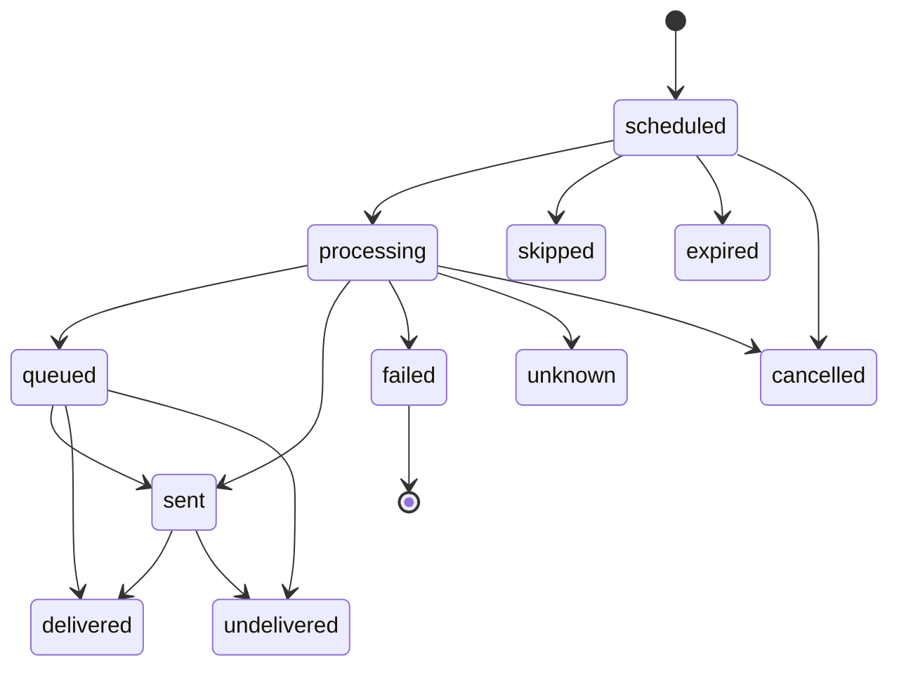

# Engineering Specification

## Ting Ting Website Admin and Rent Reminder System

**Derived from:** `docs/Ting Ting Admin PRD.md`  
**Status:** Adversarially reviewed; implementation awaits client confirmations and environment provisioning  
**Last updated:** 2026-07-24  
**Architecture:** Low-traffic full-stack monolith  

> **2026-07-27 reminder-policy amendment:** The scheduling sections below are
> retained as historical v1 context. The implemented source of truth is
> [Reminder Global Scheduling Change Plan](./Reminder%20Global%20Scheduling%20Change%20Plan.md):
> tenant payment due day plus one global lead time, local send time, timezone,
> and email template. Legacy per-tenant schedule writes return
> `GLOBAL_REMINDER_POLICY`.
**Primary runtime:** Next.js + TypeScript  
**Database:** Supabase Postgres  
**Production hosting:** Render paid Web Service (Starter initially)  
**Production region:** Oregon for Render and Supabase  
**Default timezone:** America/Vancouver

## 1. System Boundaries

The system contains:

- Public website renderer.
- Private admin interface.
- Server-side content, tenant, schedule, and notification services.
- Postgres database and storage.
- Scheduled reminder runner.
- Email and SMS provider adapters.
- Provider delivery webhooks.

The system does not contain payment processing, rent balance logic, tenant authentication, two-way messaging, lease management, or maintenance-ticket workflows.

## 2. Repository Shape

```text
src/
  app/
    (public)/
      page.tsx
      rentals/
    admin/
      login/
      content/
      tenants/
      notifications/
      settings/
    api/
      internal/reminders/run/
      webhooks/resend/
      webhooks/twilio/
  components/
    public/
    admin/
  features/
    content/
      registry.ts
      schemas/
      repository.ts
      service.ts
    rentals/
    tenants/
    reminders/
      scheduler.ts
      occurrence.ts
      service.ts
    notifications/
      outbox.ts
      template-renderer.ts
      providers/
        email.ts
        sms.ts
        resend.ts
        twilio.ts
  lib/
    auth/
    env/
    supabase/
    validation/
supabase/
  migrations/
  seed.sql
tests/
  unit/
  integration/
  e2e/
```

Feature modules own their validation, database access, and business rules. Route handlers and server actions remain thin.

## 3. Environment Configuration

Required server variables:

```text
NEXT_PUBLIC_SUPABASE_URL
NEXT_PUBLIC_SUPABASE_ANON_KEY
SUPABASE_SERVICE_ROLE_KEY
SUPABASE_STORAGE_PUBLIC_BUCKET
REMINDER_CRON_SECRET
RESEND_API_KEY
EMAIL_FROM
RESEND_WEBHOOK_SECRET
TWILIO_ACCOUNT_SID
TWILIO_AUTH_TOKEN
TWILIO_MESSAGING_SERVICE_SID
TWILIO_STATUS_CALLBACK_URL
APP_BASE_URL
DEFAULT_TIMEZONE=America/Vancouver
```

Optional:

```text
SENTRY_DSN
REMINDERS_FORCE_PAUSED=true
```

All required variables are validated at server startup. Server-only variables must never be referenced from client modules.

## 4. Authentication and Authorization

### Authentication

- Supabase Auth email/password.
- Production admin accounts require verified email.
- Public signup is disabled. Admin accounts are provisioned and revoked by an authorized owner.
- MFA is mandatory before production launch. If the selected configuration cannot enforce it, authentication configuration must change before launch.
- Application sessions use a 30-minute idle limit and 12-hour absolute limit.
- Bulk sends and security changes require authentication within the preceding 10 minutes.
- Middleware protects `/admin/*` except `/admin/login`.

### Authorization

Use an `admin_profiles` table linked one-to-one with `auth.users`.

```sql
admin_profiles (
  user_id uuid primary key references auth.users(id),
  display_name text not null,
  is_active boolean not null default true,
  created_at timestamptz not null default now()
)
```

Every private page load, query, route, and mutation calls `requireAdmin()` and verifies `admin_profiles.is_active`. Browser clients never receive the Supabase service-role key.

### Database policy

- Public/anonymous clients receive no direct `SELECT` access to `site_sections`, revisions, rentals, media metadata, or any private table.
- Public server rendering reads only explicit `public_site_sections` and `public_rental_listings` projections that exclude draft and administrative columns.
- Authenticated admin access: permitted through validated server actions/routes.
- Tenant, schedule, notification, audit, and draft data: no anonymous access.
- Fixed section insertion/deletion: migration/service-role only.
- Integration tests verify that anonymous requests cannot select draft content, revisions, `updated_by`, private media, tenants, or notifications.

## 5. Database Model

All primary keys are UUIDs unless a stable text key is more appropriate. All timestamps are `timestamptz` in UTC. User-facing schedule times are converted using the row's IANA timezone.

### 5.1 Site sections

```sql
site_sections (
  key text primary key,
  display_name text not null,
  sort_order integer not null unique,
  schema_version integer not null default 1,
  draft_content jsonb not null,
  published_content jsonb not null,
  published_revision_id uuid null,
  updated_by uuid null references admin_profiles(user_id),
  updated_at timestamptz not null default now(),
  published_at timestamptz null
)
```

Seeded keys:

```text
header
hero
rental_search
property_services
featured_rentals
about
contact
footer
```

No admin endpoint exists to insert, delete, rename, or reorder these rows.

`site_sections` is private. A database view named `public_site_sections` selects only:

```text
key, schema_version, published_content, published_at
```

Only the server-side public content repository may query this projection; browser clients do not receive database credentials capable of querying private tables.

```sql
site_section_revisions (
  id uuid primary key,
  section_key text not null references site_sections(key),
  schema_version integer not null,
  content jsonb not null,
  created_by uuid not null references admin_profiles(user_id),
  created_at timestamptz not null default now()
)
```

Publishing transaction:

1. Validate draft against current section schema.
2. Insert immutable revision.
3. Copy draft to `published_content`.
4. Set `published_revision_id`, `published_at`, and actor.
5. Promote referenced draft media to immutable public paths.
6. Insert audit event.
7. Commit.
8. Revalidate affected public route.

Rollback copies a selected valid revision into both published and draft content, creates a new revision representing the rollback, and writes an audit event.

### 5.2 Media

```sql
media_assets (
  id uuid primary key,
  draft_storage_path text not null unique,
  published_storage_path text null unique,
  public_url text null,
  state text not null default 'draft'
    check (state in ('draft','published','archived')),
  original_filename text not null,
  mime_type text not null,
  byte_size bigint not null,
  width integer null,
  height integer null,
  alt_text text not null,
  created_by uuid not null references admin_profiles(user_id),
  created_at timestamptz not null default now(),
  archived_at timestamptz null
)
```

Allowed initial MIME types: JPEG, PNG, WebP, AVIF. SVG upload is excluded from MVP. Draft objects live in a private bucket and use short-lived signed preview URLs. Publishing copies/promotes referenced objects to immutable public paths. Assets referenced by a published revision cannot be archived or deleted. Enforce size, dimensions, and detected file signature; do not trust the browser MIME header alone.

### 5.3 Rentals

```sql
rental_listings (
  id uuid primary key,
  slug text not null unique,
  title text not null,
  address_line text not null,
  neighbourhood text null,
  city text not null,
  monthly_rent_cents integer not null check (monthly_rent_cents > 0),
  bedrooms numeric(3,1) not null,
  bathrooms numeric(3,1) not null,
  square_feet integer null,
  available_on date null,
  pet_policy text null,
  description text not null,
  status text not null check (status in ('draft','published','archived')),
  sort_order integer not null default 0,
  created_by uuid not null references admin_profiles(user_id),
  updated_by uuid not null references admin_profiles(user_id),
  created_at timestamptz not null default now(),
  updated_at timestamptz not null default now(),
  published_at timestamptz null
)

rental_listing_images (
  id uuid primary key,
  rental_listing_id uuid not null references rental_listings(id),
  media_asset_id uuid not null references media_assets(id),
  sort_order integer not null,
  is_cover boolean not null default false,
  unique (rental_listing_id, sort_order)
)

rental_listing_revisions (
  id uuid primary key,
  rental_listing_id uuid not null references rental_listings(id),
  content_snapshot jsonb not null,
  action text not null check (action in ('publish','unpublish','archive')),
  created_by uuid not null references admin_profiles(user_id),
  created_at timestamptz not null default now()
)
```

A partial unique index enforces at most one `is_cover=true` image per listing; publish validation requires exactly one. Listing slugs become immutable after first publish. Explicit `unpublishRental` and archive operations create revision snapshots.

### 5.4 Tenants

```sql
tenants (
  id uuid primary key,
  full_name text not null,
  property_label text not null,
  unit_label text null,
  email text null,
  phone_e164 text null,
  preferred_channels text[] not null default '{}',
  email_contact_status text not null default 'unconfirmed'
    check (email_contact_status in (
      'unconfirmed','allowed','opted_out','invalid','bounced','complained','suppressed'
    )),
  sms_contact_status text not null default 'unconfirmed'
    check (sms_contact_status in (
      'unconfirmed','allowed','opted_out','invalid','suppressed'
    )),
  email_contact_status_reason text null,
  sms_contact_status_reason text null,
  email_contact_status_source text null,
  sms_contact_status_source text null,
  contact_permission_note text null,
  contact_permission_updated_at timestamptz null,
  timezone text not null default 'America/Vancouver',
  internal_notes text null,
  is_active boolean not null default true,
  archived_at timestamptz null,
  created_by uuid not null references admin_profiles(user_id),
  updated_by uuid not null references admin_profiles(user_id),
  created_at timestamptz not null default now(),
  updated_at timestamptz not null default now(),
  check (preferred_channels <@ array['email','sms']::text[])
)
```

Application validation:

- At least one contact method is required before enabling a schedule.
- Email channel requires a valid email.
- SMS channel requires an E.164 phone.
- A channel requires its contact status to be `allowed`.
- Archived tenants are forced inactive.

### 5.5 Templates

```sql
notification_templates (
  id uuid primary key,
  name text not null,
  channel text not null check (channel in ('email','sms')),
  subject_template text null,
  body_template text not null,
  is_active boolean not null default true,
  created_by uuid not null references admin_profiles(user_id),
  updated_by uuid not null references admin_profiles(user_id),
  created_at timestamptz not null default now(),
  updated_at timestamptz not null default now()
)

notification_template_revisions (
  id uuid primary key,
  template_id uuid not null references notification_templates(id),
  channel text not null check (channel in ('email','sms')),
  subject_template text null,
  body_template text not null,
  created_by uuid not null references admin_profiles(user_id),
  created_at timestamptz not null default now()
)
```

Allowed variables:

```text
{{tenant_name}}
{{property}}
{{unit}}
{{due_date}}
{{business_name}}
{{business_phone}}
{{business_email}}
```

The renderer rejects unknown variables and missing required values.

Every template save creates an immutable revision. Schedules reference the current template, while materialized events and frozen batches reference a specific revision.

### 5.6 Reminder schedules

```sql
reminder_schedules (
  id uuid primary key,
  tenant_id uuid not null unique references tenants(id),
  rent_due_day smallint not null default 1 check (rent_due_day between 1 and 31),
  day_of_month smallint not null check (day_of_month between 1 and 31),
  local_time time not null,
  timezone text not null default 'America/Vancouver',
  channels text[] not null,
  email_template_id uuid null references notification_templates(id),
  sms_template_id uuid null references notification_templates(id),
  is_enabled boolean not null default false,
  next_run_at timestamptz null,
  last_processed_at timestamptz null,
  created_by uuid not null references admin_profiles(user_id),
  updated_by uuid not null references admin_profiles(user_id),
  created_at timestamptz not null default now(),
  updated_at timestamptz not null default now(),
  check (
    channels <@ array['email','sms']::text[]
    and cardinality(channels) > 0
  )
)
```

`next_run_at` is recalculated whenever the schedule changes and after each claimed occurrence.

Schedule mutation validation rejects duplicate channels, invalid IANA timezone names, a channel/template mismatch, or an enabled channel without its matching template. Changing day, time, timezone, enabled state, tenant active state, or channel eligibility recalculates `next_run_at` atomically.

### 5.7 Notification events

```sql
notification_events (
  id uuid primary key,
  tenant_id uuid not null references tenants(id),
  schedule_id uuid null references reminder_schedules(id),
  template_id uuid not null references notification_templates(id),
  template_revision_id uuid not null references notification_template_revisions(id),
  retry_of_event_id uuid null references notification_events(id),
  source text not null check (source in ('scheduled','manual','test','retry')),
  channel text not null check (channel in ('email','sms')),
  occurrence_key text not null unique,
  occurrence_local_date date not null,
  scheduled_for timestamptz not null,
  status text not null check (
    status in (
      'scheduled','processing','queued','sent','delivered',
      'failed','undelivered','skipped','unknown','expired','cancelled'
    )
  ),
  rendered_subject text null,
  rendered_body text null,
  render_error_code text null,
  render_context jsonb null,
  destination text null,
  destination_masked text null,
  provider text null,
  provider_message_id text null,
  provider_status text null,
  attempt_count integer not null default 0,
  provider_request_started_at timestamptz null,
  next_attempt_at timestamptz null,
  claim_token uuid null,
  claim_expires_at timestamptz null,
  last_error_code text null,
  last_error_message text null,
  claimed_at timestamptz null,
  sent_at timestamptz null,
  delivered_at timestamptz null,
  created_by uuid null references admin_profiles(user_id),
  created_at timestamptz not null default now(),
  updated_at timestamptz not null default now()
)

notification_attempts (
  id uuid primary key,
  event_id uuid not null references notification_events(id),
  attempt_number integer not null,
  started_at timestamptz not null,
  completed_at timestamptz null,
  outcome text null,
  provider text null,
  provider_message_id text null,
  safe_error_code text null,
  unique (event_id, attempt_number)
)
```

Occurrence key format:

```text
scheduled:{schedule_id}:{occurrence_local_date}:{channel}
manual:{batch_id}:{tenant_id}:{channel}
test:{request_uuid}:{channel}
retry:{original_event_id}:{attempt_number}
```

The scheduled key and a partial unique index on `(schedule_id, channel, occurrence_local_date)` are the database-level duplicate-occurrence boundary. `occurrence_local_date` is derived once from the schedule timezone, never from UTC worker time. Provider message IDs are unique per provider when present.

A composite foreign key ensures that an event's `tenant_id` matches the referenced schedule's tenant. `notification_attempts` records provider name, and a partial unique index protects non-null `(provider, provider_message_id)` pairs.

Pre-render fields may be null while an event is `scheduled` or terminally skipped for validation. Before provider submission, a status-dependent database check/service invariant requires the immutable destination snapshot, template revision, approved render-context fields, rendered content, and provider. `render_context` contains only the approved template variables, not the full tenant row. `destination` is private PII, is never returned by list endpoints unless explicitly needed, and follows notification-retention rules. `destination_masked` is used for ordinary admin lists and logs.

### 5.8 Manual batches

```sql
notification_batches (
  id uuid primary key,
  request_id uuid not null unique,
  selection_digest text not null,
  created_by uuid not null references admin_profiles(user_id),
  template_email_revision_id uuid null references notification_template_revisions(id),
  template_sms_revision_id uuid null references notification_template_revisions(id),
  requested_channels text[] not null,
  selected_count integer not null,
  eligible_count integer not null,
  status text not null check (status in ('draft','confirmed','processing','completed','partial','failed','expired')),
  confirmation_idempotency_key text null unique,
  expires_at timestamptz not null,
  confirmed_at timestamptz null,
  completed_at timestamptz null,
  created_at timestamptz not null default now()
)

notification_batch_recipients (
  id uuid primary key,
  batch_id uuid not null references notification_batches(id),
  tenant_id uuid not null references tenants(id),
  channel text not null check (channel in ('email','sms')),
  eligibility_status text not null check (eligibility_status in ('eligible','skipped')),
  skip_reason text null,
  destination_snapshot text null,
  destination_masked text null,
  template_revision_id uuid not null references notification_template_revisions(id),
  tenant_version_snapshot timestamptz not null,
  contact_permission_updated_at_snapshot timestamptz null,
  created_at timestamptz not null default now(),
  unique (batch_id, tenant_id, channel)
)
```

Preview freezes this table. Confirmation either sends exactly the frozen eligible set or rejects and requires re-preview if tenant version, contact permission, template state, or destination has changed. Eligibility is the intersection of: active and unarchived tenant, requested channel is preferred and allowed, valid destination, unsuppressed channel, active template revision, and enabled/manual-send policy.

### 5.9 Settings and audit

```sql
system_settings (
  key text primary key,
  value jsonb not null,
  updated_by uuid null references admin_profiles(user_id),
  updated_at timestamptz not null default now()
)

audit_events (
  id uuid primary key,
  actor_user_id uuid null references admin_profiles(user_id),
  action text not null,
  target_type text not null,
  target_id text null,
  metadata jsonb not null default '{}',
  created_at timestamptz not null default now()
)

reminder_worker_runs (
  id uuid primary key,
  started_at timestamptz not null,
  completed_at timestamptz null,
  status text not null check (status in ('running','completed','partial','failed','paused')),
  occurrences_created integer not null default 0,
  events_dispatched integer not null default 0,
  events_failed integer not null default 0,
  backlog_remaining integer not null default 0,
  safe_error_code text null
)
```

Seed setting:

```json
{
  "key": "reminders",
  "value": {
    "paused": true,
    "pausedAt": null,
    "pausedBy": null
  }
}
```

## 6. Fixed Content Registry — PRD Appendix A

The registry is the structural contract between the admin and public frontend.

```ts
type SectionDefinition<T> = {
  key: SectionKey;
  displayName: string;
  schemaVersion: number;
  schema: z.ZodType<T>;
  editor: React.ComponentType<SectionEditorProps<T>>;
  publicComponent: React.ComponentType<T>;
  revalidatePaths: string[];
};
```

### Approved fixed registry

| Key | Editable fields | Fixed constraints | Public route |
|---|---|---|---|
| `header` | brand name, brand subtitle, navigation labels, contact CTA label/link | Navigation identities and count are fixed: Rent, Service, About, Contact CTA | `/` and all public routes |
| `hero` | eyebrow, heading, body, background image/alt text, primary CTA label/link | One image, one CTA, no arbitrary blocks | `/` |
| `rental_search` | field labels/placeholders, option labels, submit label | Location, property type, price, beds, and baths controls are fixed; search behavior is code-owned | `/` |
| `property_services` | eyebrow, heading, body, primary CTA, five service titles/summaries/detail copy/CTAs | Fixed tuple identities: renovation, handyman, maintenance, strata, rental_management; items cannot be added, removed, or reordered | `/` and service detail presentation |
| `featured_rentals` | eyebrow, heading, intro, view-all CTA, empty-state text/CTA | Listing cards come from `rental_listings`; section itself is fixed | `/` |
| `about` | eyebrow, heading, one to three paragraphs, portrait/alt text, optional CTA | One portrait and a maximum of three paragraphs | `/` |
| `contact` | heading, body, visible contact details, field labels, submit label, success/error copy | Form field identities and delivery behavior are code-owned | `/` |
| `footer` | brand summary, contact details, office text, social URLs, disclosure/legal text | Column identities and link groups are fixed | all public routes |

Field limits:

- Short labels and CTA labels: 1–40 characters.
- Eyebrows: 1–80 characters.
- Headings: 1–120 characters.
- Summary/body fields: 1–500 characters unless a schema gives a narrower limit.
- About paragraphs: 1–1,000 characters each, maximum three.
- Service bullet lists: zero to eight items per fixed service, 1–120 characters each.
- Internal links must use an allowlisted public route; external/social links require `https`.
- Images require a media asset ID and non-empty alt text of at most 160 characters.

Service detail copy is nested within `property_services`; it is not represented by five independently addable website sections. Changing this registry requires a code migration, schema-version increment, revision compatibility test, PRD update, and client approval.

### Exhaustive section schemas

These schemas are the implementation contract, not illustrative examples:

```ts
const shortText = z.string().trim().min(1).max(40);
const headingText = z.string().trim().min(1).max(120);
const bodyText = z.string().trim().min(1).max(500);
const altText = z.string().trim().min(1).max(160);
const httpsUrl = z.string().url().refine((value) => value.startsWith('https://'));
const internalHref = z.enum([
  '/',
  '/rentals',
  '/#rentals',
  '/#services',
  '/#about',
  '/#contact'
]);

const mediaRefSchema = z.object({
  mediaAssetId: z.string().uuid(),
  alt: altText
}).strict();

const ctaSchema = z.object({
  label: shortText,
  href: internalHref
}).strict();

const headerSchema = z.object({
  brandName: z.string().trim().min(1).max(60),
  brandSubtitle: z.string().trim().min(1).max(60),
  navigation: z.tuple([
    z.object({ key: z.literal('rent'), label: shortText, href: z.literal('/#rentals') }).strict(),
    z.object({ key: z.literal('service'), label: shortText, href: z.literal('/#services') }).strict(),
    z.object({ key: z.literal('about'), label: shortText, href: z.literal('/#about') }).strict()
  ]),
  contactCta: z.object({
    label: shortText,
    href: z.literal('/#contact')
  }).strict()
}).strict();

const heroSchema = z.object({
  eyebrow: z.string().trim().min(1).max(80),
  heading: headingText,
  body: z.string().trim().min(1).max(300),
  background: mediaRefSchema,
  primaryCta: z.object({
    label: shortText,
    href: z.literal('/#rentals')
  }).strict()
}).strict();

const rentalSearchSchema = z.object({
  locationLabel: shortText,
  locationPlaceholder: z.string().trim().min(1).max(80),
  propertyTypeLabel: shortText,
  anyPropertyTypeLabel: shortText,
  priceRangeLabel: shortText,
  anyPriceLabel: shortText,
  bedsLabel: shortText,
  anyBedsLabel: shortText,
  bathsLabel: shortText,
  anyBathsLabel: shortText,
  submitLabel: shortText
}).strict();

const serviceDetailSchema = z.object({
  eyebrow: z.string().trim().min(1).max(80),
  heading: headingText,
  body: bodyText,
  includedHeading: shortText,
  includedItems: z.array(z.string().trim().min(1).max(120)).min(1).max(8),
  processHeading: shortText,
  processBody: bodyText,
  primaryCtaLabel: shortText,
  secondaryCtaLabel: shortText
}).strict();

const serviceCardSchema = z.object({
  title: z.string().trim().min(1).max(60),
  summary: z.string().trim().min(1).max(180),
  ctaLabel: shortText,
  detail: serviceDetailSchema
}).strict();

const propertyServicesSchema = z.object({
  eyebrow: z.string().trim().min(1).max(80),
  heading: headingText,
  body: bodyText,
  services: z.tuple([
    serviceCardSchema.extend({ key: z.literal('renovation') }).strict(),
    serviceCardSchema.extend({ key: z.literal('handyman') }).strict(),
    serviceCardSchema.extend({ key: z.literal('maintenance') }).strict(),
    serviceCardSchema.extend({ key: z.literal('strata') }).strict(),
    serviceCardSchema.extend({ key: z.literal('rental_management') }).strict()
  ]),
  primaryCta: z.object({
    label: shortText,
    href: z.literal('/#contact')
  }).strict()
}).strict();

const featuredRentalsSchema = z.object({
  eyebrow: z.string().trim().min(1).max(80).optional(),
  heading: headingText,
  intro: bodyText.optional(),
  viewAllCta: z.object({
    label: shortText,
    href: z.literal('/rentals')
  }).strict(),
  emptyState: z.object({
    heading: headingText,
    body: bodyText,
    cta: z.object({
      label: shortText,
      href: z.literal('/#contact')
    }).strict()
  }).strict()
}).strict();

const aboutSchema = z.object({
  eyebrow: z.string().trim().min(1).max(80),
  heading: headingText,
  paragraphs: z.array(z.string().trim().min(1).max(1000)).min(1).max(3),
  portrait: mediaRefSchema,
  cta: ctaSchema.optional()
}).strict();

const contactSchema = z.object({
  heading: headingText,
  body: bodyText,
  publicPhone: z.string().trim().min(7).max(30),
  publicEmail: z.string().email(),
  fieldLabels: z.object({
    name: shortText,
    email: shortText,
    phone: shortText,
    preferredContact: shortText,
    message: shortText
  }).strict(),
  preferredContactOptions: z.tuple([
    z.object({ key: z.literal('email'), label: shortText }).strict(),
    z.object({ key: z.literal('phone'), label: shortText }).strict(),
    z.object({ key: z.literal('sms'), label: shortText }).strict()
  ]),
  submitLabel: shortText,
  successMessage: z.string().trim().min(1).max(240),
  errorMessage: z.string().trim().min(1).max(240)
}).strict();

const footerSchema = z.object({
  brandName: z.string().trim().min(1).max(60),
  brandSubtitle: z.string().trim().min(1).max(60),
  summary: z.string().trim().min(1).max(240),
  phone: z.string().trim().min(7).max(30),
  email: z.string().email(),
  officeLines: z.array(z.string().trim().min(1).max(120)).min(1).max(4),
  socialLinks: z.object({
    facebook: httpsUrl.optional(),
    instagram: httpsUrl.optional(),
    linkedin: httpsUrl.optional()
  }).strict(),
  disclosureParagraphs: z.array(z.string().trim().min(1).max(1200)).min(1).max(3)
}).strict();

export const sectionSchemas = {
  header: headerSchema,
  hero: heroSchema,
  rental_search: rentalSearchSchema,
  property_services: propertyServicesSchema,
  featured_rentals: featuredRentalsSchema,
  about: aboutSchema,
  contact: contactSchema,
  footer: footerSchema
} satisfies Record<SectionKey, z.ZodTypeAny>;
```

All objects are strict: unknown fields fail validation. The five Property Services identities and all navigation/form control identities are fixed tuples. Admins may edit their approved content, but cannot add, remove, rename, or reorder structural items.

### Safe rich text

MVP preference: structured plain text, lists, and CTA fields. If rich text is required, store a restricted document format and render through an allowlist. Do not accept raw HTML.

## 7. Admin Routes and Operations

### Pages

```text
GET /admin
GET /admin/content
GET /admin/content/[sectionKey]
GET /admin/rentals
GET /admin/rentals/[id]
GET /admin/tenants
GET /admin/tenants/[id]
GET /admin/notifications/send
GET /admin/notifications/templates
GET /admin/notifications/history
GET /admin/settings
```

### Server actions / handlers

```text
saveSectionDraft(sectionKey, payload, expectedVersion)
publishSection(sectionKey, expectedUpdatedAt)
rollbackSection(sectionKey, revisionId, expectedVersion)

createRental(payload)
updateRental(id, payload, expectedVersion)
publishRental(id)
unpublishRental(id)
archiveRental(id)

createTenant(payload)
updateTenant(id, payload, expectedVersion)
archiveTenant(id)
saveReminderSchedule(tenantId, payload, expectedVersion)

previewNotification(payload)
createManualBatch(payload, requestId)
confirmManualBatch(batchId, confirmationIdempotencyKey, acknowledgedRecipientCount)
retryNotificationEvent(eventId)
setReminderPause(paused, expectedVersion)
```

Every mutable resource has a monotonically increasing version or `updated_at` precondition. Draft saves, publish, rollback, tenant/schedule/template/rental edits, and pause changes return a conflict rather than silently overwriting newer data.

## 8. Scheduling Algorithm

### 8.1 Next occurrence

Input:

- `dayOfMonth`
- `localTime`
- IANA `timezone`
- `afterInstant`

Algorithm:

1. Convert `afterInstant` to the schedule timezone.
2. Consider the current local month.
3. Clamp requested day to the final calendar day of that month.
4. Combine clamped date and local time.
5. Resolve to an instant using timezone rules.
6. If the result is not strictly after `afterInstant`, repeat for the next month.
7. Persist UTC result as `next_run_at`.

The template `due_date` value is computed from `rent_due_day`: choose the first clamped local due date on or after the reminder occurrence. This keeps the payment due date separate from the date on which the reminder is sent.

DST behavior:

- If a local time does not exist during spring-forward, move to the next valid instant that day.
- If a local time occurs twice during fall-back, use the earlier occurrence.
- Unit tests must encode both rules.

Use a timezone-aware library or Temporal implementation; do not manually calculate UTC offsets.

### 8.2 Cron runner

Supabase Cron invokes:

```text
POST /api/internal/reminders/run
Authorization: Bearer <REMINDER_CRON_SECRET>
```

Frequency: every five minutes.

High-level transaction:

1. Reject an invalid secret and create a `reminder_worker_runs` row.
2. If globally or force-paused, record a paused run and return without materializing or dispatching.
3. Materialize due occurrences:
   - select up to 200 enabled schedules where `next_run_at <= now()`;
   - lock with `FOR UPDATE SKIP LOCKED`;
   - derive and persist canonical `occurrence_local_date`;
   - snapshot tenant display fields, permitted destination, template revision, rendered content, and computed due date;
   - if the occurrence is no more than 24 hours late, create one event per eligible channel with `INSERT ... ON CONFLICT DO NOTHING`;
   - if snapshot/render validation fails, create a visible `skipped` event with a safe reason rather than silently omitting it;
   - if older than 24 hours, create one visible `expired` occurrence and advance directly to the next future month without catch-up sends;
   - advance `next_run_at` atomically and update `last_processed_at`.
4. Independently drain the durable outbox, including events created by earlier runs:
   - select `scheduled` events where `next_attempt_at is null or <= now()`;
   - claim with `FOR UPDATE SKIP LOCKED`;
   - assign `claim_token` and a 10-minute `claim_expires_at`;
   - process a maximum of 200 events with provider concurrency capped at 10 and an invocation time budget of 45 seconds;
   - leave undispatched eligible events in `scheduled` for the next run.
5. Recover expired claims:
   - if `provider_request_started_at` is null, clear the claim and return the event to `scheduled`;
   - if a provider request started but no provider result was recorded, mark the event `unknown` for reconciliation rather than retrying automatically.
6. Persist run counts, backlog size, completion status, and safe errors.

The materializer and outbox drainer are independent. A crash after occurrence creation cannot strand an event because every later invocation scans the durable outbox.

### 8.3 Event processing

1. Atomically transition a claimed `scheduled` event to `processing` and insert a `notification_attempts` row.
2. Recheck global pause, tenant active/archive state, schedule enabled state, channel permission/suppression, destination validity, and template state.
3. If eligibility changed, transition to `cancelled` or `skipped` with a safe reason.
4. Render from the immutable template revision and destination snapshot. On a render error, transition to `skipped` with `render_error_code`.
5. Set `provider_request_started_at`, then call the channel provider adapter.
6. Store provider ID and transition to `queued` or `sent`.
7. Provider webhook later transitions to a terminal state and may suppress the tenant channel after an opt-out, hard bounce, complaint, or invalid-destination result.
8. On a retryable error known to have occurred before provider acceptance, persist `next_attempt_at` using bounded exponential backoff and return to `scheduled`.
9. On an ambiguous timeout after the provider request begins, transition to `unknown` and do not retry automatically.
10. After the configured maximum safe attempts, transition to `failed`.

Maximum automatic attempts: 3. Provider errors classified as permanent are not retried. Retry state is persisted; no retry depends on the lifetime of the current serverless invocation.

## 9. Provider Interfaces

```ts
type SendResult = {
  providerMessageId: string;
  status: 'queued' | 'sent';
  providerStatus?: string;
};

interface EmailProvider {
  send(input: {
    to: string;
    subject: string;
    html: string;
    text: string;
    idempotencyKey: string;
  }): Promise<SendResult>;
}

interface SmsProvider {
  send(input: {
    to: string;
    body: string;
    statusCallbackUrl: string;
  }): Promise<SendResult>;
}
```

### Email

- Resend adapter sends one recipient per event.
- Set an idempotency key derived from `occurrence_key`.
- Webhook updates delivered, bounced/failed, or equivalent provider states.

### SMS

- Twilio adapter sends one recipient per event.
- Record returned Message SID.
- Use application-level at-most-once submission: atomically record `provider_request_started_at` before the API call.
- If the request outcome is ambiguous and no Message SID is available, move to `unknown`; never automatically resubmit.
- Configure a status callback.
- Include an event-specific signed reference in the callback URL where supported.
- Validate Twilio webhook signatures using the official SDK.
- Map provider states into internal states without assuming every carrier reports `delivered`.

The system guarantees zero duplicate scheduled occurrence rows and zero automatic SMS resubmission after ambiguity. It does not claim provider-level exactly-once delivery for SMS.

## 10. Manual Send Flow

### Preview

Input:

- Selection mode: tenant IDs or all active.
- Requested channels.
- Template revision IDs.
- Client-generated `request_id`.

Output:

- Total selected.
- Eligible by channel.
- Skipped and reasons.
- Fully rendered samples.
- SMS segment estimate.
- Exact frozen tenant/channel rows and a deterministic selection digest.

### Confirmation

The admin confirms a server-created batch ID using a unique confirmation idempotency key and typed eligible-recipient count. The server compares current eligibility versions with the frozen preview. If relevant data changed, confirmation is rejected and a new preview is required. Otherwise, it creates notification events from exactly the frozen eligible rows. Client-provided recipient identities or counts are never trusted as the source of truth.

### Protection

- Confirmation endpoint accepts each batch only once.
- Replaying batch creation with the same `request_id` returns the original batch.
- Replaying confirmation with the same idempotency key returns the original result.
- A batch expires after 30 minutes if not confirmed.
- Rate limit manual batch creation and confirmation.
- UI disables duplicate submission.
- “Send all” never overrides tenant channel preference or suppression. A preference override is limited to a single recipient and requires an explicit duplicate/permission warning.

## 11. Webhooks

### Twilio

```text
POST /api/webhooks/twilio
```

- Read the exact public callback URL and form parameters.
- Verify the Twilio signature with the official SDK.
- Find by provider message ID.
- Update only allowed forward status transitions.
- Return 2xx for already-processed callbacks.

### Resend

```text
POST /api/webhooks/resend
```

- Verify provider webhook signature.
- Find the event by provider message ID or stored metadata.
- Apply idempotent status transition.
- Store safe error code; avoid copying sensitive provider payloads wholesale.

## 12. Status Transition Rules



Terminal states:

- `delivered`
- `undelivered`
- `failed`
- `skipped`
- `unknown`
- `expired`
- `cancelled`

Retrying a failed event creates a new event with `source='retry'`; it never rewrites the original event's history or moves the original event back to `processing`.

Callbacks must not move a terminal event backward.

## 13. Public Rendering and Caching

- Public components receive validated published content only.
- Section data may be fetched once per page render.
- Tenant-related tables are never queried by public routes.
- Publishing triggers path revalidation.
- Images use responsive sizes and optimized formats.
- If the current published revision fails validation under the active schema, search backward for the newest compatible valid revision. Use seeded fallback content only when no compatible revision exists.
- Section schema upgrades include revision migration or explicit backward-compatibility tests.

## 14. Security Controls

- CSRF-safe server actions or same-site protected endpoints.
- Strict server authorization for private data.
- Zod validation at every mutation boundary.
- Storage MIME and size checks.
- Content Security Policy appropriate for image and provider domains.
- Rate limits:
  - login: provider/default auth protection plus application monitoring;
  - publish: 20/min/admin;
  - test send: 5/10 min/admin;
  - manual batch confirmation: 3/10 min/admin;
  - internal cron: secret-authenticated only.
- Mask phone/email in list views where full value is unnecessary.
- Never expose provider secrets, service-role keys, or cron secret.
- Webhook signature verification is mandatory.
- Provider feedback that represents opt-out, complaint, hard bounce, invalid destination, or suppression updates the tenant channel before any future send eligibility check.
- Audit externally visible changes and sends.

## 15. Observability

### Dashboard queries

- Active tenant count.
- Enabled schedule count.
- Due in next seven days.
- Failed/undelivered in last 30 days.
- Most recent worker run.
- Global pause state.
- Durable outbox backlog and oldest eligible event age.

### Structured logs

Include:

- request/job ID;
- event ID;
- channel;
- source;
- status;
- safe error classification.

Exclude:

- full name;
- full destination;
- full message body;
- provider credentials;
- raw webhook payloads.

### Health checks

- Worker run timestamp older than 15 minutes while unpaused creates a dashboard warning and admin email.
- Backlog older than the 24-hour grace threshold creates an admin email.
- Repeated provider failures above the configured threshold create a dashboard warning and admin email.
- A daily reconciliation query compares due schedule occurrences with notification events and reports gaps.
- These alerts use the existing transactional email provider; no separate observability platform is required.

## 16. Testing Strategy

### Unit tests

- Every content schema accepts valid content and rejects boundary violations.
- Template variable validation and rendering.
- Phone/email normalization.
- Next occurrence for:
  - ordinary month;
  - day 29–31 in short months;
  - leap year;
  - Vancouver spring-forward;
  - Vancouver fall-back;
  - occurrence exactly at current instant.
- Provider status mapping.

### Integration tests

- Publish transaction creates revision and audit entry.
- Stale update returns conflict.
- Anonymous database/public requests cannot read draft content, revisions, unpublished media, tenant data, or notification data.
- Archived tenant is ineligible.
- Suppressed, opted-out, invalid, bounced, or complained channels are ineligible.
- Due schedule claim uses row locking.
- Duplicate occurrence insert returns existing/no-op.
- Concurrent runner calls produce one event per channel.
- Crash after event insert but before dispatch is recovered by the next run.
- Crash after claim but before provider call is recovered after lease expiry.
- Retry scheduled for a future time survives process termination.
- Stale claim after provider request begins becomes `unknown` and is not automatically retried.
- Global pause prevents claims.
- A 24-hour late occurrence sends once; older and multiple missed months expire without catch-up bursts.
- Disabling a tenant/schedule after claim prevents provider submission.
- Manual batch creation and confirmation are idempotent.
- Manual batch confirmation uses the exact frozen preview set or rejects when eligibility changed.
- Retry creates a new retry occurrence without modifying the original history.
- Invalid webhook signatures are rejected.
- Repeated valid webhooks are idempotent.
- Permanent provider feedback suppresses future channel eligibility.

### Browser tests

1. Login and logout.
2. Edit Hero draft, preview, publish, and observe public change.
3. Roll back a published section.
4. Add and publish a rental.
5. Add tenant and enable schedule.
6. Preview and confirm a manual send using mocked providers.
7. Pause and resume scheduled reminders.
8. Filter failed delivery history and retry an eligible event.

### Provider contract tests

Use provider test credentials or mocked HTTP responses in CI. Production dry runs use admin-owned contacts only.

### Capacity test

Materialize and dispatch 100 tenants across both channels at one timestamp. With provider clients mocked at realistic latency, verify bounded concurrency, request time budget, durable backlog continuation, and the five-minute submission target. If the target cannot be met, replace only the outbox drainer with a small managed background worker; keep the database model and monolith.

## 17. Migration and Seed Strategy

- Migrations are append-only after production launch.
- Seed fixed section keys and initial approved homepage content.
- Seed default SMS and email templates in disabled/draft form.
- Seed reminders globally paused.
- Import tenants only after client review of normalized email, phone, property, channel, and schedule columns.
- Run a dry-run report before enabling any real schedule.

## 18. Deployment

### Render Web Service

Deploy the full Next.js application as a Render Node Web Service, not a Static Site.

```text
Plan: Paid Starter initially
Region: Oregon
Build command: pnpm install --frozen-lockfile && pnpm build
Start command: pnpm start -- -H 0.0.0.0 -p $PORT
Health check: /api/health
```

- Store all persistent relational data and media in Supabase. Render's local filesystem is ephemeral.
- Run production on a paid, always-on instance. Application behavior must not include keep-alive traffic or other logic intended to prevent free-tier sleep.
- Treat the Next.js process as replaceable: deployments, platform maintenance, health-check recovery, and failures may restart it at any time.
- Do not store reminder schedules, locks, queues, uploaded media, or other durable state in process memory or on Render's local filesystem.
- Keep the reminder endpoint protected by `REMINDER_CRON_SECRET`, and keep the secret in Render environment settings and the Supabase Cron/Vault configuration.
- `APP_BASE_URL` is the custom domain in production and the `onrender.com` URL before domain cutover.

### Region and data locality

- The expected visitors, administrator, and tenants are in Greater Vancouver.
- Deploy the Render Web Service in Oregon, the closest currently supported Render region.
- Create the Supabase project in the specific `West US (Oregon)` region so the application and database are colocated.
- Store timestamps in UTC. Interpret schedules and display user-facing dates in `America/Vancouver`, including daylight-saving transitions.
- Global multi-region compute is out of scope. Static assets may still use platform or storage CDN caching.
- Changing either production region requires a migration plan and must not be treated as a configuration-only change.

### Supabase Cron

Create one five-minute Cron job that sends an authenticated HTTP request to:

```text
POST https://<render-host>/api/internal/reminders/run
Authorization: Bearer <REMINDER_CRON_SECRET>
```

The request triggers the reminder runner; it is not a Render keep-alive mechanism. The application-level durable outbox remains required because paid services can still restart, deployments can interrupt work, and an HTTP invocation can fail or time out.

### Service-tier constraints and operating guardrails

- Render production compute is paid and always on, but the application does not assume uninterrupted process lifetime or exactly-once HTTP invocation.
- Supabase Free may pause projects with insufficient activity.
- Supabase Free has no automatic database backups.
- Supabase Free storage/database quotas require image optimization and usage monitoring.
- Weekly encrypted logical database exports are downloaded and stored off-platform; the accepted recovery point is up to seven days.

Upgrade triggers:

- scheduler health misses two consecutive 15-minute alert windows;
- Render Starter memory or CPU pressure causes repeated health-check failures, slow responses, or failed builds;
- availability requirements exceed the guarantees of the selected Render service;
- database or storage exceeds 70% of free allowance;
- automatic backups or a stricter recovery point become necessary.

### Environments

- Local: Supabase local or dedicated development project, mocked providers.
- Preview: local or time-limited Render test deployment with reminders force-paused and provider test credentials.
- Production MVP: Render paid Starter Web Service in Oregon + Supabase in `West US (Oregon)`, verified sender domain, and production SMS sender.

### Launch sequence

1. Deploy with reminders force-paused.
2. Create admin and enable MFA.
3. Seed and verify public content.
4. Import or enter tenants.
5. Validate schedule next-run values.
6. Send email and SMS dry runs to admin contacts.
7. Verify provider callbacks.
8. Enable cron while global pause remains active.
9. Verify cron health.
10. Create, download, and restore-test the first encrypted logical database export.
11. Client approves templates and recipients.
12. Remove force-pause and explicitly unpause in admin.

## 19. Data Retention

Initial implementation proposal:

- Content revisions: retain indefinitely unless storage becomes material.
- Archived tenants: retain only for the client-approved operational/legal period, then anonymize or delete through a documented procedure.
- Notification metadata and statuses: retain 24 months.
- Full rendered message subject/body and destination: redact after 90 days while retaining hashes, status, provider ID, and timestamps.
- Audit events: retain 24 months.

Final retention values must be approved before production tenant import. Provide export, correction, and deletion procedures with any required legal-hold exceptions. The UI warns admins not to place unnecessary sensitive information in `internal_notes`.

## 20. Acceptance Test Matrix

| PRD area | Engineering evidence |
|---|---|
| Fixed sections | Seeded section registry, no create/delete endpoints, tuple schemas for fixed cards |
| Draft/publish | Revision transaction, preview mode, path revalidation |
| Tenant management | CRUD/archive integration and browser tests |
| Monthly scheduling | Timezone and month-edge unit tests |
| Automated reminders | Cron claim integration test and production dry run |
| Manual reminders | Single-use batch confirmation browser/integration test |
| Duplicate prevention | Unique occurrence key and concurrent-runner test |
| Delivery status | Signed webhook contract tests |
| Pause control | Integration test confirming zero claims |
| Security | Auth/RLS tests, secret scanning, webhook signature tests |

## 21. Known Trade-offs

- A five-minute polling job is less exact than one dedicated scheduled job per tenant, but is simpler and sufficiently precise for monthly reminders.
- A Postgres outbox is less flexible than a dedicated queue, but is appropriate for approximately 100 tenants and provides durable duplicate protection.
- JSONB section content requires coordinated schema migrations when the frontend structure changes, but it preserves the fixed-layout product requirement.
- One application couples public and admin deployments, but materially reduces operational overhead for this scale.
- One monthly schedule per tenant avoids a generic recurrence engine; additional reminder patterns require a later schema revision.
