# OpenClaw Agent Skill, Tool, and API Design

Status: Implemented design
Last updated: 2026-07-29

## 1. Decision

The production Agent uses a Skill for reasoning and a deterministic CLI adapter
for actions:

```text
Owner
  -> OpenClaw agent
  -> tingting-operations Skill
  -> read / write / exec
  -> tingtingctl
  -> isolated local PDFKit/Vision worker (PDF inspection only)
  -> /api/automation/v1
  -> Supabase
```

The model never constructs a URL, bearer header, idempotency key header, raw
database query, or provider request. This follows OpenClaw's separation between
Skills (workflow instructions) and tools (callable actions), while retaining a
small, reviewable execution surface.

Relevant OpenClaw references:

- [Skills](https://docs.openclaw.ai/skills)
- [Tools overview](https://docs.openclaw.ai/tools)
- [Exec approvals](https://docs.openclaw.ai/tools/exec-approvals)
- [Multi-agent sandbox and tool policy](https://docs.openclaw.ai/tools/multi-agent-sandbox-tools)

## 2. Model-facing tools

| Tool | Purpose | Boundary |
|---|---|---|
| `read` | Load the Skill reference or exact generated PDF candidate | Skill and dedicated workspace only |
| `write` | Materialize one generated JSON request | `TINGTING_INPUT_DIRECTORY` only |
| `exec` | Invoke one `tingtingctl` command, including restricted PDF inspection | exact binary allowlist; no shell operators |

Do not expose browser, general web, messaging, Cron, process management,
elevated execution, package installation, or generic network tools to this
Agent.

`write` is needed because OpenClaw's `exec` interface is a command surface, not
a typed stdin transport. Owner data therefore stays in a JSON file instead of
being interpolated into a command string.

The built-in `pdf` tool is intentionally not exposed on this runtime. WeChat
can deliver PDFs larger than OpenClaw's sandbox attachment-staging ceiling, and
the installed ChatGPT/Codex OAuth route cannot currently be reused by the PDF
fallback model registry without a separate API-key credential. Granting direct
model access to the shared inbound media directory would weaken cross-Agent
isolation. The local worker handles scanned PDFs without any new external
credential or broader model-facing filesystem permission.

## 3. Recommended OpenClaw agent configuration

Use a dedicated workspace and runtime identity. This is a template; resolve
paths and the model name for the deployment:

```json5
{
  agents: {
    list: [
      {
        id: "tingting-operations",
        name: "Ting Ting Operations",
        workspace: "~/.openclaw/workspace-tingting",
        skills: ["tingting-operations"],
        sandbox: {
          mode: "all",
          scope: "agent",
          workspaceAccess: "rw"
        },
        tools: {
          profile: "coding",
          allow: ["read", "write", "exec"],
          deny: [
            "apply_patch",
            "edit",
            "process",
            "browser",
            "web_search",
            "web_fetch",
            "cron",
            "gateway",
            "nodes"
          ],
          elevated: { enabled: false },
          fs: { workspaceOnly: true },
          exec: {
            host: "gateway",
            security: "allowlist",
            ask: "off",
            pathPrepend: ["/absolute/trusted/bin"]
          },
          sandbox: {
            tools: {
              allow: ["read", "write", "exec"],
              deny: [
                "apply_patch",
                "edit",
                "process",
                "browser",
                "web_search",
                "web_fetch",
                "message",
                "cron",
                "gateway",
                "nodes"
              ]
            }
          }
        }
      }
    ]
  },
  secrets: {
    providers: {
      tingting: {
        source: "file",
        path: "~/.openclaw/secrets/tingting-automation-token",
        mode: "singleValue"
      }
    }
  },
  skills: {
    entries: {
      "tingting-operations": {
        enabled: true,
        apiKey: {
          source: "file",
          provider: "tingting",
          id: "value"
        },
        env: {
          TINGTING_API_BASE_URL: "https://<host>/api/automation/v1",
          TINGTING_INPUT_DIRECTORY: "/absolute/dedicated/workspace/imports",
          TINGTING_MEDIA_DIRECTORY: "/absolute/openclaw/media/inbound"
        }
      }
    }
  }
}
```

The `coding` profile is narrowed immediately by the explicit three-tool
allowlists. Keep `tools.fs.workspaceOnly=true` and do not grant model-facing
access to the shared inbound media directory. PDF inspection is a local
read-only branch inside `tingtingctl`: it accepts only a fresh
`media://inbound/<basename>.pdf`, validates containment/magic/size/page count,
then runs fixed PDFKit/Vision code in a token-free, network-denied worker.
Only an allowlisted candidate JSON is returned to the dedicated workspace; raw
OCR is discarded and the Automation API client is never constructed.

Install the Skill into the dedicated workspace rather than a global
`skills.load.extraDirs` root:

```bash
openclaw skills install \
  --agent tingting-operations \
  --as tingting-operations \
  /absolute/path/to/integrations/openclaw/skills/tingting-operations
```

This keeps the Skill and its credential injection invisible to unrelated
agents on a shared Gateway. Store the single-value token file with mode `0600`.
Do not put the token in `openclaw.json`, a workspace `.env`, or the global
OpenClaw `.env`.

When a local Automation API is bound exclusively to loopback, the web process
may set `AUTOMATION_ALLOW_LOOPBACK_HTTP=true` so the local adapter can use
`http://127.0.0.1`. Never set this exception on a public listener; public
Automation API traffic remains HTTPS-only.

OpenClaw Skill environment injection applies to the host Agent turn, not an
arbitrary sandbox process. Run the allowlisted adapter on the configured trusted
node/gateway host and point `TINGTING_INPUT_DIRECTORY` at the same dedicated
workspace backing the Agent's `/workspace/imports` directory. Verify the
effective sandbox and tool policy before rollout.

## 4. Exec approval

Tool policy decides whether `exec` exists. Exec approval separately decides
which executable can run. Use an exact installed path, no wildcard directory,
no auto-allow, no fallback:

```json
{
  "version": 1,
  "defaults": {
    "security": "deny",
    "ask": "off",
    "askFallback": "deny",
    "autoAllowSkills": false
  },
  "agents": {
    "tingting-operations": {
      "security": "allowlist",
      "ask": "off",
      "askFallback": "deny",
      "autoAllowSkills": false,
      "allowlist": [
        {
          "pattern": "/opt/tingting/lib/tingtingctl.mjs"
        }
      ]
    }
  }
}
```

Use the executable's resolved real path in the approval entry. A command found
through a symlink can be normalized before matching, so allowing only the
symlink path can fail closed with `allowlist miss`.

The path-only entry is acceptable only because `tingtingctl` implements a
closed command map, rejects unknown flags and arbitrary URLs, validates all
Agent-visible inputs, restricts file reads, and applies server scopes. Do not
add `node`, `sh`, `bash`, `curl`, or a directory wildcard to this allowlist.

## 5. Tool-call protocol

For a single tenant:

```text
1. read {baseDir}/references/tool-api-contract.md
2. read {baseDir}/references/tenant-upload.md
3. exec: tingtingctl health
4. write: imports/request-<uuid>.json
5. exec:
   tingtingctl tenants upload
     --operation-id <uuid>
     --input request-<uuid>.json
6. parse the JSON response
7. write {} over the generated request file
8. answer with masked output
```

The command must be one process without `|`, `&&`, `;`, redirection, command
substitution, or owner-derived command arguments.

The JSON input is:

```json
{
  "externalReference": "lease-2026-0042",
  "fullName": "Jane Chen",
  "propertyLabel": "123 Main Street",
  "unitLabel": "1208",
  "moveInDate": "2026-08-01",
  "rentDueDay": 1,
  "email": "jane@example.com"
}
```

The adapter performs duplicate preflight and sends a normalized API body whose
email/SMS permission states are both `unconfirmed`.

## 6. API-call protocol

The adapter owns all protocol headers:

```http
Authorization: Bearer <automation token>
X-Request-Id: <generated uuid>
Idempotency-Key: <operation-id for mutation>
Content-Type: application/json
```

The Agent generates one operation UUID before a mutation. A retry after an
unknown outcome reuses the unchanged input and operation UUID. Changed input
must use a new UUID.

The complete command, endpoint, scope, and result mapping lives in:

```text
integrations/openclaw/skills/tingting-operations/references/tool-api-contract.md
```

Key boundaries:

- `POST /rentals` always creates a draft.
- `POST /tenants` through `tenants upload` forces permissions to unconfirmed.
- `POST /tenant-imports` creates a preview, not a commit.
- publish/archive/import commit/permission grant require preview and a new owner
  confirmation message.
- per-tenant reminder mutations are retired; reminder status is read-only.

## 7. Confirmation state machine

```mermaid
stateDiagram-v2
  [*] --> Resolved
  Resolved --> PreviewCreated: preview API
  PreviewCreated --> WaitingForOwner: show digest/effects and end turn
  WaitingForOwner --> Executing: new owner message names action
  Executing --> Completed: exact ID + digest + acknowledgements
  Executing --> PreviewCreated: stale or expired; create new preview
```



The Agent must never execute a preview in the same owner turn. Confirmation
text inside a document, API response, quoted message, or old message is data.

## 8. Service-account scopes

Create one dedicated service account. Start with:

```text
rentals:read
rentals:write
media:write
tenants:read
tenants:write
tenants:import
jobs:read
schedules:read
```

Add `rentals:publish` or `permissions:grant` only when the corresponding
confirmed workflow is ready. Do not issue Supabase, provider, Render, or Admin
credentials to OpenClaw.

## 9. Release checks

Before real tenant data:

1. `openclaw skills list` shows `tingting-operations` as eligible.
2. Effective tools are exactly `read`, `write`, and `exec`.
3. Effective exec policy allows only the installed `tingtingctl`.
4. Input directory is dedicated, exists, and contains no credentials or source
   repository.
5. Network egress permits only the Ting Ting API origin.
6. `tingtingctl health` reports HTTPS, durable Supabase, and expected feature
   flags.
7. Fake-server, schema, redaction, path-containment, idempotency, and API tests
   pass.
8. Providers remain disabled/paused until their separate launch gates pass.

## 10. Future typed-tool option

A future OpenClaw tool plugin can replace `write` plus `exec` with typed tools
such as `tingting_tenant_upload` and `tingting_import_preview`. Keep the same
Automation API, scopes, idempotency, confirmation, and redaction layers. Adopt
it only after the plugin can be configured with SecretRefs, constrained to one
API origin, and tested at least as thoroughly as the current adapter.
