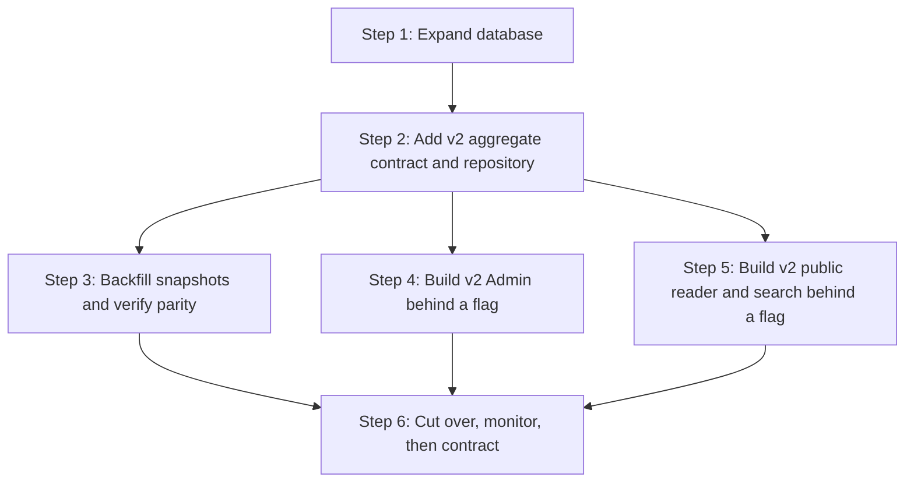

# Rental Listing Database and Admin Creation Plan

**Status:** Draft for review  
**Scope:** Rental listing data model, Admin create/edit workflow, public listing projections, and migration safety  
**Out of scope:** Tenant-to-property normalization, external listing syndication, map/geocoding provider integration, and a public application portal

**Test plan:** [Rental Listing V2 Test Plan](../docs/Rental%20Listing%20V2%20Test%20Plan.md)

## 1. Outcome

Replace the current flat listing record with a listing-centered model that can represent:

- the physical rental home and its structured address;
- the commercial listing: rent, availability, lease terms, and publication state;
- structured parking, storage, pet, smoking, utility, fee, and contact details;
- categorized amenities that can be displayed and filtered without parsing description text;
- the existing image, draft, publish, archive, revision, audit, and OpenClaw workflows.

The Admin remains one create/edit page. The separation between a physical property and a listing is handled by the application, not exposed as a database-style workflow to the administrator.

## 2. Current-State Findings

The current `rental_listings` table contains:

- title and slug;
- one free-form `address_line`, neighbourhood, and city;
- monthly rent, beds, baths, square feet, and one available date;
- one free-form `pet_policy`;
- one description;
- publication status and homepage sort order.

The current limitations are:

1. Building name, unit number, province, postal code, and property type cannot be represented independently.
2. `available_on` cannot distinguish “available now,” “available on a date,” and “contact for availability.”
3. Parking, storage, utilities, lease requirements, smoking, furnishing, and contact details are forced into `description`.
4. Amenities cannot be filtered or grouped into unit, appliance, building, and nearby categories.
5. `pet_policy` cannot reliably represent allowed/considered/not allowed, animal types, count, size, deposit, and notes.
6. The public property-type search currently infers the type from title/description text.
7. The listing revision snapshot currently serializes the main row, not the complete aggregate of images and future child records.

## 3. Key Design Decisions

### 3.1 Separate physical property from listing lifecycle

Create `rental_properties` for the durable physical home/address and retain `rental_listings` for rent, availability, marketing, and website publication.

One Admin form saves both records in one transaction. Admin users do not need to visit a separate “Properties” page in this release.

For this MVP, one property row belongs to one listing. Enforce a unique
`rental_listings.property_id` relationship and do not expose “choose an existing
property.” This avoids cross-listing draft edits and concurrency surprises.
Property reuse/relisting can be introduced later by relaxing that constraint
with an explicit product workflow.

Benefits:

- a home can be relisted later without recreating or losing its address identity;
- unit and building data no longer mix with publication status;
- future tenant-to-property linking remains possible without redesigning listings;
- listing revisions focus on what was advertised at a given time.

### 3.2 Keep fixed, filterable vocabularies

Property types, amenity codes, utility codes, policy statuses, and fee types are controlled vocabularies seeded by migrations. The Admin shows plain-language options.

Free text remains available only for:

- listing title;
- description;
- building name and address components;
- special policy notes;
- utility, parking, storage, lease, and contact notes when needed.

### 3.3 Preserve legacy fields during migration

Do not directly rename or drop `address_line` or `pet_policy`.

Use expand-contract:

1. Add new nullable structures.
2. Deploy dual-read/dual-write application code.
3. Backfill safe defaults and flag ambiguous legacy values for Admin review.
4. Switch public/admin reads to the new model.
5. Stop writing legacy fields.
6. Drop legacy fields only in a later release after production verification.

### 3.4 Keep the primary Admin path non-technical

The form follows:

`Context → Basic home details → Rent and availability → Features and policies → Description and photos → Completeness preview → Save privately or publish`

Slug, source-system identity, audit metadata, and homepage ordering do not belong in the primary create flow.

### 3.5 Public listings read an immutable published snapshot

The existing implementation updates the same `rental_listings` row used by the
public view. That means editing an already-published row can make public content
change before the administrator presses “Publish to website.”

The new model must separate editable current content from live content:

- normalized property/listing/child tables hold the current Admin draft;
- publishing creates a complete immutable revision snapshot;
- `rental_listings.published_revision_id` points to the live revision;
- the public view reads only the pointed-to revision, never the mutable draft
  tables;
- saving an edited published listing sets a derived “unpublished changes”
  state but does not change the website; every aggregate save must advance the
  listing `updated_at`, even when only property or child rows changed;
- unpublishing removes the row from the public projection without deleting its
  published revision history.

This snapshot boundary is also what prevents an address or amenity edit in a
shared physical-property record from silently changing another live listing.

## 4. Target Database Structure

### 4.1 `rental_properties`

Represents the physical rental home.

| Column | Type | Required | Notes |
|---|---|---:|---|
| `id` | `uuid` | yes | Primary key |
| `property_type` | `text` | nullable at rest; required for manual save/publish | `apartment`, `condo`, `townhome`, `house`, `basement_suite`, `room`, `other` |
| `building_name` | `text` | no | Example: `Seasons` |
| `unit_number` | `text` | no | Example: `1703`; text preserves letters and leading zeros |
| `street_address` | `text` | yes after backfill | Example: `5028 Kwantlen Street` |
| `neighbourhood` | `text` | no | Example: `Lansdowne Village` |
| `city` | `text` | yes | Do not default silently to Vancouver |
| `province_code` | `text` | no to save, yes to publish | Default `BC` visibly in Admin; stored explicitly |
| `postal_code` | `text` | no to save, yes to publish | Normalize to `A1A 1A1` |
| `country_code` | `text` | yes | Default `CA`; uppercase two-letter check |
| `latitude` | `numeric(9,6)` | no | Advanced/system-populated |
| `longitude` | `numeric(9,6)` | no | Advanced/system-populated |
| `created_by` / `updated_by` | `uuid` | yes | Existing attribution pattern |
| `created_at` / `updated_at` | `timestamptz` | yes | Optimistic concurrency remains listing-based |

Recommended indexes:

- `(city, neighbourhood, property_type)` for public filtering;
- `(postal_code)` where not null;
- an exact normalized address lookup index may be added later if a concrete
  normalization rule is approved.

Do not enforce a hard unique constraint or build fuzzy duplicate warnings in
the first release. Formatting differences can otherwise block legitimate
saves, and fuzzy matching is not required for the listing-form MVP.

### 4.2 `rental_listings`

Retain existing identity, workflow, audit, and publication columns. Add:

| Column | Type | Required | Admin meaning |
|---|---|---:|---|
| `property_id` | `uuid` FK | yes after backfill | Physical home |
| `currency_code` | `text` | yes | `CAD`; uppercase three-letter check; read-only in primary UI |
| `den_count` | `smallint` | no | Number of dens |
| `availability_status` | `text` | no to save, yes to publish | `available_now`, `available_on`, `contact` |
| `available_on` | `date` | conditional | Required only for `available_on` |
| `furnished_status` | `text` | no to save, yes to publish | `unfurnished`, `furnished`, `partly_furnished` |
| `lease_type` | `text` | no to save, yes to publish | `fixed_term`, `month_to_month`, `flexible` |
| `minimum_lease_months` | `smallint` | conditional | Example: `12` |
| `smoking_policy` | `text` | no to save, yes to publish | `not_allowed`, `outdoor_only`, `allowed`, `contact` |
| `credit_check_required` | `boolean` | nullable for migrated data | New manual listings explicitly save true/false |
| `references_required` | `boolean` | nullable for migrated data | New manual listings explicitly save true/false |
| `parking_available` | `boolean` | nullable for migrated data | New manual listings explicitly save true/false |
| `parking_type` | `text` | conditional | `underground`, `garage`, `surface`, `street`, `carport`, `other` |
| `parking_stalls` | `smallint` | conditional | Non-negative |
| `parking_included` | `boolean` | conditional | Included in monthly rent |
| `parking_notes` | `text` | no | Exceptions or secondary parking arrangement |
| `visitor_parking_available` | `boolean` | nullable for migrated data | New manual listings explicitly save true/false |
| `storage_available` | `boolean` | nullable for migrated data | New manual listings explicitly save true/false |
| `storage_lockers` | `smallint` | conditional | Non-negative |
| `storage_included` | `boolean` | conditional | Included in monthly rent |
| `storage_notes` | `text` | no | Storage details not covered by count |
| `pet_status` | `text` | no to save, yes to publish | `not_allowed`, `considered`, `allowed` |
| `cats_allowed` | `boolean` | conditional | Visible for considered/allowed |
| `dogs_allowed` | `boolean` | conditional | Visible for considered/allowed |
| `pet_max_count` | `smallint` | no | Optional |
| `pet_size_limit_lbs` | `smallint` | no | Optional |
| `pet_notes` | `text` | no | Special conditions only |
| `utilities_notes` | `text` | no | Exceptions not covered by checkboxes |
| `contact_mode` | `text` | yes | `site_default` or `custom` |
| `contact_name` | `text` | conditional | Required for custom contact |
| `contact_email` | `text` | conditional | At least email or phone for custom contact |
| `contact_phone` | `text` | conditional | At least email or phone for custom contact |
| `amenity_notes` | `text` | no | Unusual features not represented by the fixed catalog |
| `published_revision_id` | `uuid` FK | no | Immutable revision currently shown publicly |
| `draft_digest` | `text` | yes after v2 save | Digest of the complete current aggregate |
| `review_required_fields` | `text[]` | yes | Internal migration/import review flags; never public |

Existing columns retained:

- `id`, `slug`, `title`;
- `monthly_rent_cents`, `bedrooms`, `bathrooms`, `square_feet`;
- `description`, `status`, `sort_order`;
- source/external identity;
- attribution and timestamps.

Legacy columns retained only during transition:

- `address_line`;
- `neighbourhood`;
- `city`;
- `pet_policy`.

Recommended checks:

- `available_on is not null` when `availability_status = 'available_on'`;
- parking details are null/zero when parking is unavailable;
- storage details are null/zero when storage is unavailable;
- cat/dog and pet limit fields are null/false when pets are not allowed;
- amounts and counts are non-negative;
- custom contact includes a name and at least one reachable channel;
- postal code is required by publish validation, not initial nullable schema migration.

Every controlled vocabulary receives a database `CHECK` constraint. Publish-only
fields remain nullable at rest so incomplete and imported drafts can persist;
the publish RPC, not `NOT NULL`, enforces public completeness.

`published_revision_id` must be constrained to a revision belonging to the same
listing. Use a composite relationship or an equivalent database constraint;
checking this only in application code is insufficient.

### 4.3 `rental_amenities`

Fixed catalog, seeded by migration.

| Column | Type | Notes |
|---|---|---|
| `code` | `text` PK | Stable machine identity |
| `category` | `text` | `unit`, `appliance`, `building`, `nearby` |
| `label` | `text` | Admin/public label |
| `sort_order` | `integer` | Stable display order |
| `is_active` | `boolean` | Hide without deleting history |

Initial catalog:

- Unit: balcony, ensuite bathroom, air conditioning, laminate flooring,
  walk-in closet, floor-to-ceiling windows, wheelchair access, private yard,
  mountain view, city view, park view, water view.
- Appliances: refrigerator, stove/oven, gas stove, dishwasher, microwave, in-suite washer, in-suite dryer.
- Building: elevator, fitness room, recreation room, social lounge, swimming pool, hot tub, sauna, concierge, video surveillance, on-site staff, shared laundry, bicycle storage.
- Nearby: public transit, shopping, grocery, parks, schools, restaurants.

### 4.4 `rental_listing_amenities`

| Column | Type | Notes |
|---|---|---|
| `rental_listing_id` | `uuid` FK | Cascade on listing delete |
| `amenity_code` | `text` FK | References fixed catalog |

Primary key: `(rental_listing_id, amenity_code)`.

Use `on delete cascade` from listing to associations and `on delete restrict`
from associations to catalog codes so historical codes cannot be removed while
referenced.

### 4.5 `rental_utilities`

Fixed catalog:

- water;
- hot water;
- gas;
- electricity;
- heating;
- internet;
- sewage;
- garbage collection.

Columns follow the amenity catalog pattern: `code`, `label`, `sort_order`, `is_active`.

### 4.6 `rental_listing_utilities`

Rows mean “included in monthly rent.” Absence means “not advertised as included.”

Primary key: `(rental_listing_id, utility_code)`.

This keeps the Admin interaction as a simple checkbox list without incorrectly asserting that every unchecked utility is unavailable.

### 4.7 `rental_listing_fees`

Optional repeatable fees.

| Column | Type | Notes |
|---|---|---|
| `id` | `uuid` | Primary key |
| `rental_listing_id` | `uuid` FK | Parent listing |
| `fee_type` | `text` | `security_deposit`, `pet_deposit`, `parking`, `storage`, `move_in`, `other` |
| `label` | `text` | Required for `other` |
| `amount_cents` | `integer` | Positive |
| `frequency` | `text` | `one_time`, `monthly` |
| `refundable` | `boolean` | Plain-language Admin checkbox |
| `required` | `boolean` | Plain-language Admin checkbox |
| `notes` | `text` | Optional |
| `sort_order` | `integer` | Display order |

### 4.8 Existing image and revision tables

Keep `rental_listing_images` unchanged.

Change revision creation so `content_snapshot` contains the complete published aggregate:

- listing row;
- property snapshot;
- selected amenities;
- included utilities;
- fees;
- ordered images and cover identity.

Add a `schema_version` column to revision rows so future code can interpret and
migrate older snapshots safely.

Add `source_digest` to each publish revision. Admin derives “unpublished
changes” by comparing `rental_listings.draft_digest` with the live revision's
`source_digest`, not from timestamps alone.

The public projection reads the snapshot referenced by
`published_revision_id`. This prevents a private save from changing the live
site and prevents a history screen from showing a listing row without the
features that were published with it.

The current release needs accurate immutable history and a live revision
pointer. A user-facing “restore this rental revision” action is a later feature;
do not imply that revision browsing/restoration is included unless it is added
to scope explicitly.

## 5. Admin Create/Edit Form Plan

### 5.1 Card 1: Home and address

| Label | Control | Required | Behaviour |
|---|---|---:|---|
| Listing title | Text input | save + publish | Marketing title; suggests slug before first publish |
| Property type | Single-select | save + publish | Apartment, Condo, Townhome, House, Basement suite, Room, Other |
| Building name | Text input | no | Example: Seasons |
| Unit number | Text input | no | Text, not numeric |
| Street address | Text input | save + publish | No unit number inside this field |
| Neighbourhood | Text input | no | Search/display value |
| City | Combobox/text input | save + publish | Common Metro Vancouver cities plus custom entry |
| Province | Single-select | publish | Defaults visibly to BC |
| Postal code | Text input | publish | Auto-uppercase and spacing |
| Country | Read-only single-select | publish | Defaults to Canada; Advanced if expansion is unnecessary |

Remove the single `Address` input from the primary form. Generate display address from the structured fields.

Normalize postal code to uppercase `A1A 1A1`. Trim contact names, lowercase
email for comparison while preserving a display-safe value, and normalize phone
to the project's existing phone format before save.

### 5.2 Card 2: Rent, layout, and availability

| Label | Control | Required | Behaviour |
|---|---|---:|---|
| Monthly rent | Currency/number input | save + publish | CAD shown beside input |
| Bedrooms | Single-select | save + publish | Studio, 1, 1.5, 2… |
| Bathrooms | Single-select | save + publish | 1, 1.5, 2… |
| Dens | Number stepper | no | Default 0 |
| Square feet | Number input | no | Positive integer |
| Availability | Radio group | publish | Available now / Available on a date / Contact for availability |
| Available date | Date input | conditional | Shows only for “Available on a date” |
| Furnishing | Radio group | publish | Unfurnished / Furnished / Partly furnished |
| Lease type | Single-select | publish | Fixed term / Month-to-month / Flexible |
| Minimum lease | Number input + “months” suffix | conditional | Defaults to 12 for fixed term; editable |

### 5.3 Card 3: Parking and storage

| Label | Control | Behaviour |
|---|---|---|
| Parking available | Checkbox/switch | Reveals parking details |
| Parking type | Single-select | Conditional |
| Number of stalls | Number stepper | Conditional, default 1 |
| Included in rent | Checkbox | Conditional |
| Visitor parking available | Checkbox | Independent |
| Parking notes | Short textarea | Optional exceptions/secondary arrangement |
| Storage available | Checkbox/switch | Reveals storage details |
| Number of lockers | Number stepper | Conditional, default 1 |
| Included in rent | Checkbox | Conditional |
| Storage notes | Short textarea | Optional |

Use checkboxes for factual yes/no inclusions. Use a single-select wherever options are mutually exclusive.

“Parking type” describes the primary stall offered with this listing. If a
listing includes multiple parking arrangements, capture the primary type here
and explain the exception in parking notes; a multi-row parking model is outside
this MVP.

### 5.4 Card 4: Pets, smoking, and application requirements

| Label | Control | Behaviour |
|---|---|---|
| Pet policy | Radio group | Not allowed / Considered / Allowed |
| Cats | Checkbox | Shows for considered/allowed |
| Dogs | Checkbox | Shows for considered/allowed |
| Maximum pets | Number stepper | Optional |
| Size limit | Number input in pounds | Optional |
| Pet notes | Short textarea | Special conditions only |
| Smoking policy | Radio group | No smoking / Outdoor only / Allowed / Contact for details |
| Credit check required | Checkbox | Default unchecked |
| References required | Checkbox | Default unchecked |

Remove the current single-line `Pet policy` field after legacy data is migrated.

### 5.5 Card 5: Utilities included in rent

Checkbox group:

- Water
- Hot water
- Gas
- Electricity
- Heating
- Internet
- Sewage
- Garbage collection

Additional utility notes: optional short textarea.

The section heading must say “Included in monthly rent.” Unchecked items are not shown publicly and are not described as unavailable.

### 5.6 Card 6: Features and amenities

Grouped checkbox lists:

1. Inside the home
2. Appliances
3. Building amenities
4. Nearby conveniences

Each option comes from the seeded catalog. No free-form amenity creation in the first release. Include one optional “Additional feature notes” textarea if an unusual feature cannot be represented.

Replace the generic `View` amenity with explicit options such as mountain view,
city view, park view, and water view. Unusual views belong in Additional feature
notes.

### 5.7 Card 7: Fees and deposits

Optional repeatable rows:

| Label | Control |
|---|---|
| Fee type | Single-select |
| Amount | Currency input |
| Frequency | Radio/select: One time / Monthly |
| Required | Checkbox |
| Refundable | Checkbox |
| Notes | Short text input |

Use this card as the only source for security deposits, pet deposits, parking
fees, storage fees, and move-in fees. Do not duplicate those amounts in parking,
storage, or pet columns.

### 5.8 Card 8: Contact

Default:

- checked checkbox: “Use Ting Ting’s website contact information.”

When unchecked, reveal:

- contact/manager name — text input;
- phone — tel input;
- email — email input.

Require at least phone or email for a custom contact.

### 5.9 Card 9: Description and photos

| Label | Control |
|---|---|
| Listing description | Long textarea |
| Photos | Existing media picker, maximum 20 |
| Use image | Checkbox per image |
| Cover image | Radio per selected image |
| Photo order | Existing Move earlier/later controls or accessible drag/reorder |

Do not duplicate structured utilities, parking, pets, or amenities in the description guidance. Description helper text should ask for layout, views, finishes, location, and what makes the home distinctive.

### 5.10 Advanced and system-managed fields

Move out of the primary create grid:

- URL slug: automatically generated, read-only after first publish;
- homepage order: manage from the rental list with explicit reorder controls;
- source system and external reference: read-only;
- latitude/longitude: Advanced/system-managed;
- created/updated/published timestamps: read-only metadata;
- status: represented through Save privately, Publish to website, Remove from website, and Archive actions.

Do not expose:

- raw UUIDs;
- database field names;
- `cover_image_url`;
- catalog codes;
- revision JSON.

If an auto-generated slug already exists, show a plain-language conflict and
suggest a deterministic suffix before first publish. Never silently change the
slug after publication.

Homepage order remains live collection metadata rather than listing content.
`sort_order` is not part of the content revision snapshot. Reordering uses a
separate, explicit `Update website order` transaction and public projection may
read only `id`, immutable `slug`, publication eligibility, and `sort_order`
from the listing row while all advertised content comes from the published
revision.

### 5.11 Status, errors, and sticky actions

The editor header and sticky action bar always show one of:

- Saved privately;
- Live on website;
- Live with unpublished changes;
- Archived.

When the current aggregate digest differs from the live revision digest, the
primary public action is `Publish updates`.

Validation behaviour:

- field-level plain-language repair text;
- first invalid field receives focus after submission;
- each form card shows an issue count;
- page summary links to cards with blocking issues;
- unsaved values survive validation, version conflict, and session expiry;
- unchecked factual boxes on a new manual listing mean “No,” while migrated or
  imported unknown values remain nullable and display “Needs review” until the
  administrator explicitly chooses Yes or No.

## 6. Draft and Publish Validation

### 6.1 Required to save privately

- listing title;
- property type;
- street address;
- city;
- monthly rent;
- bedrooms;
- bathrooms;
- description.

Other fields may remain incomplete in a draft.

### 6.2 Additional requirements to publish

- province and valid postal code;
- availability selection and date when applicable;
- furnishing and lease selection;
- smoking and pet policy selections;
- exactly one cover image;
- at least one and at most 20 valid images;
- all conditional fields are internally consistent;
- custom contact has a name and at least phone or email;
- no blocking migration/import warning;
- optimistic-concurrency version still matches.

Amenities, parking, storage, utilities, fees, square feet, and pet detail limits are optional unless their parent checkbox/status requires detail.

### 6.3 Admin consequence preview

Before publish, show a summary:

- address and unit;
- rent, beds, baths, size;
- availability;
- parking/storage;
- pets and smoking;
- utilities included;
- amenity count by category;
- photo count and cover;
- contact mode;
- missing publish requirements.

Primary actions:

- `Save privately` — explicitly says the website did not change.
- `Preview saved draft` — private preview.
- `Publish to website` — confirmation states the listing becomes public.

Private preview requires:

- an authenticated route such as `/admin/rentals/{id}/preview`;
- a server-side draft aggregate loader;
- authorization on every request;
- signed/private preview URLs for draft media;
- a visible “Private draft preview” banner and return-to-Admin link;
- tests proving anonymous users cannot load draft content or media URLs.

## 7. API and Contract Shape

The application payload should become a nested aggregate instead of a flat list:

```ts
type RentalListingInput = {
  slug: string;
  title: string;
  property: {
    id: string | null;
    expectedVersion: string | null;
    propertyType: PropertyType;
    buildingName: string | null;
    unitNumber: string | null;
    streetAddress: string;
    neighbourhood: string | null;
    city: string;
    provinceCode: string | null;
    postalCode: string | null;
    countryCode: "CA";
  };
  pricing: {
    monthlyRentCents: number;
    currencyCode: "CAD";
  };
  layout: {
    bedrooms: number;
    bathrooms: number;
    denCount: number;
    squareFeet: number | null;
    furnishedStatus: FurnishedStatus | null;
  };
  availability: {
    status: AvailabilityStatus | null;
    availableOn: string | null;
    leaseType: LeaseType | null;
    minimumLeaseMonths: number | null;
  };
  parking: ParkingInput;
  storage: StorageInput;
  pets: PetPolicyInput;
  smokingPolicy: SmokingPolicy | null;
  applicationRequirements: {
    creditCheckRequired: boolean;
    referencesRequired: boolean;
  };
  amenityCodes: string[];
  includedUtilityCodes: string[];
  fees: FeeInput[];
  contact: ListingContactInput;
  description: string;
  images: RentalImageInput[];
};
```

Compatibility:

- Admin API moves to the nested contract in the same release as the new editor.
- Automation/OpenClaw contract should add a versioned v2 shape.
- Existing v1 automation inputs remain accepted during the migration window and are normalized into v2.
- Public output may remain a flat convenience shape, but should include structured `property`, policy, amenities, utility, fee, and contact objects.

MVP property semantics:

- create sends `property.id = null` and `expectedVersion = null`;
- edit sends both the current property ID and expected property `updated_at`;
- one property row is owned by one listing in this release;
- a stale property or listing version rejects the complete save.

Legacy v1 normalization:

| v1 field/gap | v2 mapping |
|---|---|
| `addressLine` | Whole value copied to `streetAddress`; no automatic unit/building parsing |
| `neighbourhood`, `city` | Copied directly |
| missing province/country | `countryCode = CA`; province may use `BC` only for confirmed Metro Vancouver data |
| missing property type | Keep nullable and add `propertyType` to `reviewRequiredFields` |
| `petPolicy` | Copy to `petNotes`; leave status nullable unless classification is unambiguous |
| missing availability/policies | Leave nullable and add field-specific review flags |
| flat v1 GET | Continue returning the flat v1 response shape for v1 routes |

Imported v1 drafts may be incomplete even when the manual Admin save schema
requires property type. They cannot be published through v2 until review flags
are resolved.

## 8. Transaction and Revision Behaviour

`save_rental_listing_v2` must atomically:

1. create or update the `rental_properties` record with a property-version
   precondition when it already exists;
2. create or update the listing with a listing-version precondition;
3. replace listing image selections;
4. replace amenity associations;
5. replace included utility associations;
6. replace fee rows;
7. write one audit event;
8. return the complete aggregate.

Publication must:

1. lock and re-check the expected listing version;
2. validate the complete aggregate;
3. promote selected media;
4. snapshot the complete aggregate in a new immutable revision;
5. set `published_revision_id`, publication status, and timestamps;
6. return the same aggregate shape used by Admin.

The public view must project typed columns from the referenced revision
snapshot. It must never join live output directly to the mutable current
property, amenity, utility, fee, or image rows.

Listing state machine:

- First publish: create a revision, set its source digest as live, set
  `published_revision_id`, and set `status = 'published'`.
- Save a live listing: keep status and pointer unchanged; advance the draft
  digest so Admin shows Live with unpublished changes.
- Publish updates: create another immutable revision and replace the pointer.
- Unpublish: clear `published_revision_id`, set `status = 'draft'`, and retain
  revision rows for history.
- Archive: clear `published_revision_id`, set `status = 'archived'`, and retain
  revision rows.

Media publication crosses Postgres and object storage and therefore cannot be
one database transaction. Use an idempotent two-phase workflow:

1. validate and prepare/promote immutable media objects;
2. commit the revision and live pointer in one database transaction;
3. if database commit fails, record/clean orphan promotions safely;
4. retries reuse deterministic media paths and request/idempotency keys.

Never allow child records to be saved in separate client requests that can leave the listing partially updated.

Both v2 mutation functions remain `security definer` with an explicit
`search_path`, are revoked from `public`, `anon`, and `authenticated`, and are
granted only to `service_role`, matching the existing server-only repository
boundary.

Automation v2 uses a trusted service-role wrapper that accepts and validates:

- source system and external reference;
- actor user ID and actor service-account ID;
- request ID and idempotency key.

It preserves the existing unique external-reference constraint and writes one
fully attributed aggregate-save audit event inside the transaction. The v1
automation adapter must call this wrapper rather than performing identity or
audit updates after the save.

## 9. Migration and Delivery Plan

### Dependency graph



Steps 3, 4, and 5 may proceed after Step 2, but no v2 mutation UI or public
reader is enabled until initial published snapshots and parity/security gates
pass. Complete Step 2 first and freeze the aggregate interface to avoid shared
contract conflicts.

### Step 1 — Expand database

**Purpose:** Add structures without breaking current code.

**Tasks**

- Create `rental_properties`, amenity/utility catalogs, association tables, and fee table.
- Add new nullable/defaulted columns to `rental_listings`.
- Seed fixed amenity and utility catalogs in a separate seed migration.
- Add indexes and RLS/revoke/grant rules consistent with existing private tables.
- Enable RLS on every new table; revoke from `PUBLIC`, `anon`, and
  `authenticated`; grant only the required v2 views/functions to
  `service_role`, with public clients limited to an explicit snapshot-field
  allowlist.
- Define FK delete behaviour explicitly: listing-owned child rows cascade,
  catalogs restrict deletion while referenced, and revision history is not
  silently deleted.
- Do not change current public/admin views or RPC signatures yet.

**Verification**

- All migrations run on an empty database.
- All migrations run on a copy containing existing listings.
- Existing application and publication tests still pass unchanged.
- Anonymous users cannot read new private tables directly.
- Public v2 output cannot expose actor IDs, source identity, review flags,
  internal notes, or raw revision data.

**Rollback**

- Before application dual-write is deployed, a forward migration may remove unused new tables/columns.
- After dual-write begins, disable v2 paths and preserve data; do not destructive-roll back.

### Step 2 — Add v2 aggregate contract and repository

**Purpose:** Establish one canonical read/write shape.

**Tasks**

- Add v2 TypeScript contracts and Zod schemas.
- Add database aggregate views or RPC readers for properties, amenities, utilities, fees, and images.
- Use compatibility names such as `admin_rental_listings_v2` and
  `public_rental_listings_v2`; do not change the type/order of existing views
  in place during the compatibility window.
- Add `save_rental_listing_v2` and v2 publication validation.
- Dual-write legacy `address_line` and `pet_policy` display values for compatibility.
- Update revision snapshots to include the full aggregate.
- Add `published_revision_id`; publish creates and points to an immutable
  aggregate revision, while public views read only that snapshot.
- Add revision `schema_version` and enforce that the live revision belongs to
  the same listing.
- Include both listing and property expected versions in update requests.
- Add `/api/automation/v2`, a v2 OpenAPI schema, confirmation-digest updates,
  integration client/skill updates, fixtures/tests, and a v1-to-v2
  normalization adapter.

**Verification**

- One save either commits every listing child record or commits none.
- A stale listing or property version rejects without changing any parent or
  child record.
- v1 automation input still creates a valid draft.
- Revision snapshot includes all child content.
- Saving changes to a published listing does not change public output until a
  new revision is published.

**Rollback**

- Before cutover, disable v2 flags and leave the new schema intact.
- After any v2 write is accepted, do not route mutations back to the old v1
  implementation. V1 mutation endpoints must call the v2 adapter or become
  read-only; otherwise structured and legacy data will diverge.

### Step 3 — Backfill snapshots and verify parity

**Purpose:** Make every existing listing safe for the snapshot-based public reader.

**Tasks**

- Keep schema and data migrations separate.
- Backfill one property row per listing:
  - copy `address_line` to `street_address` without risky parsing;
  - copy current neighbourhood/city;
  - set country `CA` and province `BC` only where business rules confirm it;
  - leave unit/building/postal data for Admin review.
- Convert `pet_policy` to `pet_notes`; classify status only when unambiguous.
- Add field-specific `review_required_fields` for missing or uncertain values.
- For every currently published listing, create an initial full v2 snapshot and
  set `published_revision_id`.
- Grandfather existing live listings: missing new fields do not remove their
  current public content. They remain live with internal “Needs review” flags,
  but the next publish is blocked until required fields are confirmed.
- Compare legacy public output with the v2 projection before enabling it.
- Verify public allowlists and all RLS/grants.

**Verification**

- Counts match before and after backfill.
- Every listing maps to exactly one property.
- Every currently published listing has a live revision pointer.
- No legacy listing disappears from the v2 public projection.
- Title, display address, price, beds, baths, size, description, and cover
  match the legacy output.
- Actor IDs, source references, internal notes, review flags, and audit metadata
  never appear in the public v2 projection.

**Rollback**

- Keep the old public reader active and preserve backfilled data.
- Correct backfill defects with a new forward data migration; never edit a
  deployed migration.

### Step 4 — Build the v2 Admin listing form behind a flag

**Purpose:** Replace free-form fields with clear conditional controls.

**Tasks**

- Implement the cards and field controls in Section 5.
- Add conditional disclosure for date, parking, storage, pets, and custom contact.
- Add grouped amenity and utility checkboxes.
- Add optional repeatable fee rows.
- Add draft-vs-publish validation and a completeness summary.
- Move slug/source/audit data to Advanced/read-only.
- Move homepage ordering to the listing collection screen.
- Add the separate `Update website order` action and transaction.
- Add `/admin/rentals/[id]/preview`, authenticated draft loading, private-media
  URL handling, and the private-preview banner.
- Add visible Saved privately / Live / Live with unpublished changes / Archived
  states, sticky actions, card issue counts, field repair text, and first-error
  focus.
- Preserve unsaved values on validation and session errors.

**Verification**

- Keyboard-only Admin can reach and operate every control.
- Checkbox and radio groups have fieldset/legend semantics.
- Hidden conditional inputs are excluded or normalized to null/false.
- Save privately never changes the public page.
- Publish cannot proceed with a missing conditional requirement or cover.
- Existing version-conflict behaviour remains.
- Anonymous preview requests fail and do not disclose signed draft-media URLs.

**Rollback**

- Keep the v2 editor disabled. After v2 writes begin, the old editor may remain
  view-only but must not perform legacy-only mutations.

### Step 5 — Build the v2 public listing and search behind a flag

**Purpose:** Use structured data instead of parsing prose.

**Tasks**

- Update `public_rental_listings` projection to return only published structured fields.
- Project those fields from `published_revision_id.content_snapshot`, not from
  mutable draft tables.
- Render address, property type, availability, policies, parking/storage, utilities, fees, amenities, and contact.
- Change property-type filtering to use `property_type`, never title/description substring matching.
- Expand query schemas, homepage search options, list-page options, labels, URL
  compatibility, and tests for apartment, condo, townhome, house, basement
  suite, room, and other.
- Add accessible grouped detail sections.
- Keep missing optional sections hidden rather than showing empty labels.
- Add structured metadata/JSON-LD only from verified public fields.

**Verification**

- Property type filters match database values.
- Draft/private child records never appear publicly.
- Legacy listings still render through compatibility fields until reviewed.
- Public cards remain compact; detailed features live on the detail page.

**Rollback**

- Keep the old public projection and renderer available behind a deployment flag until backfill verification completes.

### Step 6 — Cut over, monitor, then contract legacy fields

**Purpose:** Enable v2 without losing listings, then retire legacy writes safely.

**Tasks**

- Enable the v2 public reader first, after Step 3 parity/security gates.
- Verify live output, then enable the v2 Admin editor.
- Route all v1 and v2 automation mutations through the attributed v2
  transaction; keep v1 GET response compatibility.
- Disable legacy-only Admin/API mutations.
- Monitor listing counts, public projection errors, media promotion cleanup,
  stale-version conflicts, and audit attribution.
- Stop reading/writing legacy fields.
- In a later release, drop legacy columns only after usage searches and production verification.

**Verification**

- No published listing disappears from the public projection.
- A private save against a live listing leaves the public revision unchanged.
- New and legacy public render output is compared for title, address, price, bed, bath, size, description, and cover.
- Repository, API, automation, unit, SQL behaviour, and Supabase E2E tests pass.

**Rollback**

- Switch the public reader flag back only if no v2-only public revisions were
  published, or provide a compatibility projector from v2 snapshots.
- Keep v1 mutations routed through v2; never resume legacy-only writes.
- Any later column removal uses a new forward migration; deployed migrations are never edited.

## 10. Files and Systems Affected

Expected implementation surface:

- `supabase/migrations/*` — expand, seed, backfill, constraints, view/RPC changes;
- `supabase/seed.sql` — demo/reference data;
- `src/lib/contracts.ts` — aggregate types;
- `src/lib/schemas.ts` — Admin/API validation;
- `src/features/automation/contracts.ts` and `schemas.ts` — v2 plus compatibility;
- `src/data/store.ts` — memory-mode parity;
- `src/data/supabase-repository.ts` — aggregate mapping and RPC calls;
- `src/components/admin/rental-editor.tsx` — create/edit workflow;
- `src/app/admin/[[...segments]]/page.tsx` — list/reorder and routing;
- authenticated rental draft-preview route/loader and preview tests;
- `src/app/rentals/page.tsx` — structured filters/cards;
- `src/app/rentals/[slug]/page.tsx` — structured details;
- public homepage rental card consumers;
- unit, SQL migration-behaviour, API, automation, and Supabase E2E tests;
- Admin PRD, engineering spec, UI design document, and OpenClaw rental workflow docs.
- `docs/openclaw-integration/openapi.yaml` and relevant
  `integrations/openclaw/**` clients/skills/fixtures for automation v2.

## 11. Verification Commands

Use the project’s actual scripts from `package.json`; expected gates include:

```text
npm run lint
npm run typecheck
npm test
npm run build
npm run test:e2e
npm run test:e2e:supabase
```

Database gates:

- recreate Supabase schema from zero;
- apply new migrations to an existing seeded schema;
- run SQL migration-behaviour assertions;
- run Supabase production-write E2E;
- inspect public/admin view permissions;
- verify stale-version, atomic-save, publish, unpublish, archive, immutable
  revision, and public-snapshot behaviour.

## 12. Risks and Controls

| Risk | Control |
|---|---|
| Existing listings disappear after view change | Compatibility projection and pre-switch parity report |
| “Save privately” changes a live listing | Public projection reads only `published_revision_id` snapshot |
| Free-form addresses are parsed incorrectly | Copy whole address first; require manual review for ambiguous components |
| Child tables drift from parent listing | One transactional v2 save RPC |
| Revision history becomes incomplete | Snapshot full aggregate |
| OpenClaw integrations break | Versioned v2 contract plus temporary v1 adapter |
| V1 fallback diverges after v2 writes | V1 mutations route through v2 or become read-only |
| Legacy listings lack new publish fields | Grandfather live snapshot; block only the next publish pending review |
| Media promotion succeeds but DB publish fails | Idempotent prepare/commit/cleanup workflow |
| Admin form becomes overwhelming | Grouped cards, conditional disclosure, Advanced section, completeness summary |
| Unchecked utility is interpreted as unavailable | Public wording only claims selected utilities are included |
| Hard-coded catalog labels drift | Stable codes seeded by migration; label changes preserve codes |
| Column removal breaks older deployments | Expand-contract, usage search, separate forward-only cleanup migration |

## 13. Explicit Non-Decisions

- Do not link tenants to `rental_properties` in this project step.
- Do not build Admin screens for editing amenity/utility catalogs.
- Do not automatically scrape or import Rentals.ca data.
- Do not store third-party scores, rent trends, affordability calculations, or “updated ago” values.
- Do not add geocoding until a provider, consent, cost, and correction workflow are selected.
- Do not use JSONB as the primary store for filterable amenities, utilities, or fees.

## 14. Acceptance Criteria

The plan is complete when implementation can demonstrate:

1. Admin can create the reference-style listing without putting structured facts into description text.
2. The create/edit page clearly distinguishes text entry, single choice, and multi-choice inputs.
3. Save privately and publish remain separate and truthful.
4. Public search filters property type from a real column.
5. Public detail renders categorized amenities and included utilities.
6. Existing listing records migrate without disappearing or losing title, address, rent, description, or images.
7. OpenClaw v1 callers continue working during the compatibility window.
8. Complete immutable listing revisions can be inspected and the live site is
   tied to an explicit published revision.
9. Anonymous users cannot query draft listing/property child tables.
10. A grandfathered live listing remains visible even when new policy fields
    need review, but it cannot publish updates until those fields are resolved.
11. Admin clearly shows Live with unpublished changes and can publish those
    updates without unpublishing first.
12. Private draft preview is authenticated and does not leak draft media.
