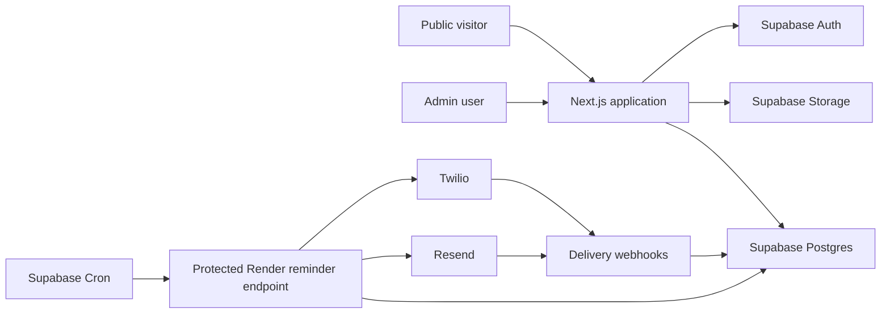
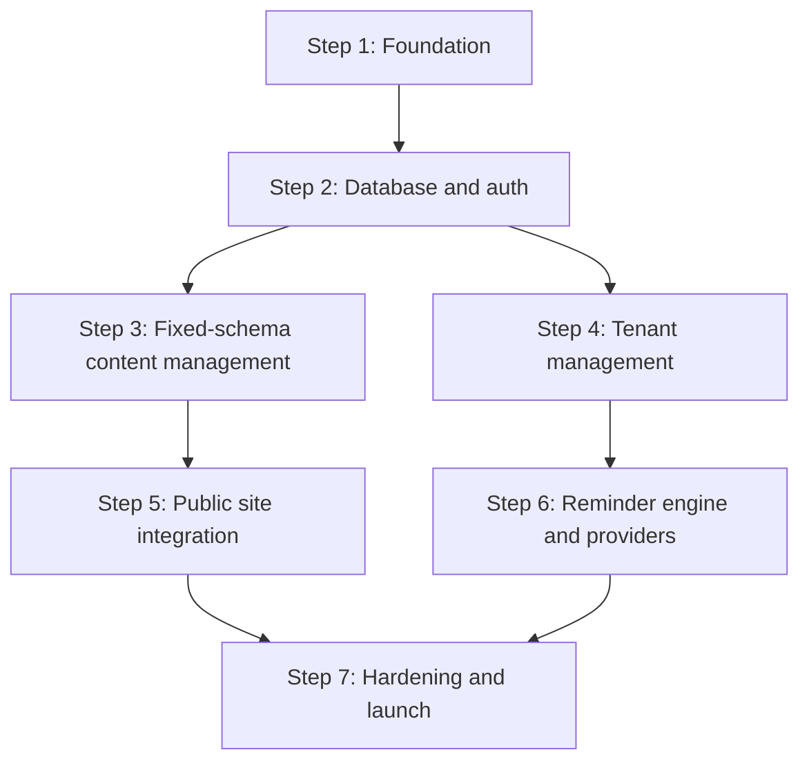

# Ting Ting Website Admin — Implementation Plan

**Status:** Reviewed construction plan; client decisions in Section 9 remain before implementation

## 1. Objective

Build a small, reliable admin application for Ting Ting's public real-estate website.

The admin has two primary responsibilities:

1. Edit the content of every existing public website section without allowing sections to be added, removed, reordered, or structurally redesigned.
2. Manage approximately 100 tenants and send rent reminders by SMS and/or email, either immediately or automatically at a tenant-specific monthly date and time.

This plan is intentionally optimized for a low-traffic, single-business system. It favors a simple monolith and managed services over infrastructure built for hypothetical scale.

## 2. Product Constraints

- One public website and one private admin.
- One primary admin at launch; the design may support a small number of future staff accounts.
- Approximately 100 active tenants.
- Public traffic is expected to remain modest.
- Website section structure is fixed in code.
- Admin users may edit section content and repeatable content items only where the schema explicitly permits it.
- Reminder occurrence creation must be idempotent. The application must never automatically resubmit an SMS after an ambiguous provider response.
- Scheduling uses `America/Vancouver` by default and must behave correctly across daylight-saving changes.
- A reminder scheduled for day 29, 30, or 31 in a shorter month runs on that month's final calendar day.
- Automated delivery may occur within five minutes of the configured time.

## 3. Recommended Tech Stack

| Area | Choice | Reason |
|---|---|---|
| Application | Next.js App Router + TypeScript | One codebase for public pages, admin UI, server mutations, and internal APIs |
| UI | React, Tailwind CSS, shadcn/ui for admin controls | Fast implementation with accessible admin primitives; public website remains custom styled |
| Database | Supabase Postgres | Managed relational database suitable for content, tenants, schedules, and delivery records |
| Authentication | Supabase Auth | Avoids building password/session infrastructure |
| Media | Supabase Storage | Banner, listing, profile, and section images in one managed service |
| Data access | Supabase server client + generated database types | Avoids an unnecessary ORM layer for a small schema |
| Validation | Zod | Shared validation for forms, JSON section schemas, API payloads, and imports |
| Hosting | Render Free Web Service for MVP | Official full Next.js support; appropriate for a low-traffic pilot with documented cold-start and uptime limits |
| Scheduler | Supabase Cron calling a protected Render endpoint every five minutes | Remains within the Supabase + Render free combination and keeps the Render service active through regular inbound requests |
| Email | Resend | Small transactional email API with idempotency support |
| SMS | Twilio Messaging | Established SMS API with delivery callbacks |
| Testing | Vitest + React Testing Library + Playwright | Unit, integration, and critical-flow browser coverage |
| Monitoring | Application delivery log + Render logs; Sentry only if production errors justify it | Appropriate observability without premature tooling |

### Stack decisions deliberately not taken

- No microservices.
- No Kubernetes.
- No Kafka, RabbitMQ, or Redis queue in the MVP.
- No separate headless CMS.
- No GraphQL.
- No event-sourcing system.
- No tenant-facing account portal.
- No custom authentication implementation.

### Stack reference notes

- Supabase provides managed Postgres, Auth, and Storage in one small-project platform: [Supabase Database](https://supabase.com/docs/guides/database/overview), [Supabase Auth](https://supabase.com/docs/guides/auth/architecture), [Supabase Storage](https://supabase.com/docs/guides/storage).
- Render supports full Next.js applications as Node.js Web Services: [Deploy a Next.js App on Render](https://render.com/docs/deploy-nextjs-app).
- Supabase Cron can run recurring jobs and make HTTP requests: [Supabase Cron](https://supabase.com/docs/guides/cron).
- Render Free Web Services spin down after 15 minutes without inbound traffic and share 750 monthly instance hours per workspace: [Render Free Instance Limits](https://render.com/docs/free). The five-minute Supabase Cron request should keep this single service active, but it will consume almost all 720–744 monthly hours.
- Supabase Free includes 500 MB database and 1 GB file storage, but no automatic backups and may pause low-activity projects: [Supabase Pricing](https://supabase.com/pricing), [Supabase Free Project Pausing](https://supabase.com/docs/guides/platform/free-project-pausing).
- Resend supports per-request idempotency keys for email submission: [Resend Send Email API](https://resend.com/docs/api-reference/emails/send-email).
- Resend Free currently includes 3,000 transactional emails per month with a 100-email daily limit, which is sufficient for this tenant count but leaves little same-day headroom for tests or retries: [Resend Pricing](https://resend.com/pricing).
- Twilio exposes outbound SMS status callbacks and delivery states, but the application still needs its own ambiguous-response policy: [Twilio Message Resource](https://www.twilio.com/docs/messaging/api/message-resource).
- Twilio SMS is pay-as-you-go rather than a permanent free production channel; message segments, carrier fees, and the leased number create a small monthly cost: [Twilio Canada SMS Pricing](https://www.twilio.com/en-us/sms/pricing/ca).

## 4. Architecture

The public site and admin are one deployable application. Provider integrations are isolated behind small adapters so email or SMS vendors can be changed without rewriting scheduling logic.

## 5. Dependency Graph

Steps 3 and 4 may be implemented in parallel after Step 2.

## 6. Implementation Steps

### Step 1 — Application foundation

**Purpose:** Establish one full-stack application and shared design foundations.

**Tasks**

- Create the Next.js TypeScript application.
- Configure Tailwind CSS and admin UI primitives.
- Define public and admin route groups.
- Add environment validation.
- Configure linting, formatting, Vitest, and Playwright.
- Add local, preview, and production environment documentation.

**Verification**

- Public homepage route renders.
- `/admin` redirects unauthenticated users to login.
- Unit and browser test commands run successfully.
- Missing required environment variables fail with a readable startup error.

**Exit criteria**

- Deployable skeleton exists with no business features.

**Rollback**

- Remove the initial application scaffold; no production data exists yet.

### Step 2 — Database, storage, and admin authentication

**Purpose:** Establish the durable data and access-control foundation.

**Tasks**

- Create database migrations for content, revisions, rentals, tenants, schedules, templates, notification events, and audit logs.
- Seed fixed website section keys.
- Configure Supabase Auth for admin accounts.
- Disable public signup and document owner-controlled provisioning and revocation.
- Require MFA for production admin accounts before launch.
- Configure private admin policies and expose only explicit published-content views/RPCs to anonymous visitors.
- Create a private draft-media bucket and public immutable published-media bucket with upload restrictions.
- Add a server-side authorization guard for every `/admin` page load, query, route, and mutation.

**Verification**

- Anonymous users cannot read tenant or reminder data.
- Anonymous users cannot read section drafts, revisions, administrative metadata, or unpublished media.
- Authenticated non-admin users cannot access admin routes.
- Fixed section rows cannot be inserted or deleted through the admin UI.
- Allowed public content and images remain readable.

**Exit criteria**

- Migrations run from an empty database and produce the expected seeded state.

**Rollback**

- Revert the migration before any real tenant data is imported.

### Step 3 — Fixed-schema website content management

**Purpose:** Allow safe editing without turning the admin into a page builder.

**Tasks**

- Complete and approve the fixed content registry, then build one Zod schema per section.
- Build the section list and section-specific forms.
- Support text, links, images, alt text, and configured repeatable items.
- Support draft saving, preview, publishing, and rollback to the previous published revision.
- Add a media picker using signed preview URLs for private draft media and promotion to public immutable paths during publish.
- Record audit entries for publish and rollback actions.
- Prevent section creation, deletion, reordering, or arbitrary HTML entry.

**Verification**

- Invalid content cannot be saved or published.
- Draft changes do not appear publicly.
- Published changes appear on the public site after cache invalidation.
- Rollback restores the preceding published revision.
- The section count and order remain unchanged.

**Exit criteria**

- Every public section shown in the approved homepage design has an editor and validated schema.

**Rollback**

- Public renderer continues using the last valid published revision.

### Step 4 — Tenant and reminder administration

**Purpose:** Manage the small tenant roster and each tenant's reminder preferences.

**Tasks**

- Build tenant list, search, add, edit, archive, and detail views.
- Store name, property/unit, email, phone, per-channel contact permission, preferred channels, timezone, active status, and internal notes.
- Build one monthly schedule per tenant for the MVP.
- Configure rent due day, reminder day, local time, channel selection, template, and enabled status.
- Show the computed next reminder time before saving.
- Validate email addresses and E.164 phone numbers.
- Add a tenant-specific test-send action that only sends to the admin's designated test address/number.
- Enforce allowed, unconfirmed, opted-out, and invalid channel states in every eligibility check.
- Add optimistic concurrency checks to tenant, schedule, and template edits.

**Verification**

- Archived tenants are excluded from automatic and bulk sends.
- A schedule cannot enable SMS without a valid phone number.
- A schedule cannot enable email without a valid email address.
- Day 29–31 schedules correctly clamp to the last day of shorter months.
- The next-run calculation is correct across Vancouver daylight-saving transitions.

**Exit criteria**

- An admin can configure every active tenant without direct database access.

**Rollback**

- Disable schedules globally; tenant records remain intact.

### Step 5 — Public website integration

**Purpose:** Render all approved content from the admin-managed source.

**Tasks**

- Map fixed section keys to fixed React components.
- Read only published revisions.
- Connect Featured Rentals to managed rental records.
- Add image optimization, required alt text, and responsive variants.
- Add preview mode for authenticated admins.
- Revalidate only the affected public routes after publish.
- Preserve a code-level fallback for missing or corrupted content.

**Verification**

- Every section renders its published content.
- Editing content cannot inject scripts or alter page structure.
- A broken draft cannot break the production homepage.
- Preview clearly identifies unpublished content.

**Exit criteria**

- The screenshot-approved homepage can be fully maintained without code changes for ordinary content updates.

**Rollback**

- Revert to seeded content or the previous published revision.

### Step 6 — Reminder engine, SMS, email, and delivery tracking

**Purpose:** Send scheduled and manual reminders reliably without building a large-scale queue.

**Tasks**

- Configure Supabase Cron to invoke the protected Render reminder endpoint every five minutes.
- Implement transactional claiming of due schedules.
- Create a notification event before calling an external provider.
- Drain previously created eligible events on every run so a process crash cannot strand them.
- Persist claim leases and retry times so recovery survives process termination.
- Enforce a database uniqueness key across tenant, schedule, channel, and scheduled occurrence.
- Add Resend and Twilio adapters.
- Add provider idempotency keys where supported.
- Record queued, sent, delivered, failed, undelivered, and skipped states.
- Treat an ambiguous provider timeout as `unknown` and require review instead of blindly retrying it.
- Verify provider webhook signatures before updating delivery status.
- Implement bounded retries for temporary failures.
- Recover events stranded before a provider request, while flagging events stranded after a provider request as unknown to avoid duplicate delivery.
- Build manual send to one, selected, or all eligible active tenants.
- Freeze the exact tenant, channel, destination, and template-revision set at preview time.
- Require explicit typed recipient-count confirmation and idempotency keys before a bulk send.
- Add a global pause switch for all automated reminders.
- Apply a 24-hour late-send grace period and expire older missed occurrences without catch-up bursts.
- Recheck tenant, channel, schedule, and pause eligibility immediately before provider submission.
- Record each worker run and send simple admin email alerts for a stale scheduler or repeated provider failures.
- Add feature-level authorization tests, rate limits, PII-safe logs, and audit entries with each send endpoint.

**Verification**

- Running the worker twice sends each occurrence only once.
- Concurrent worker invocations do not duplicate messages.
- A failed SMS does not mark email as failed, or vice versa.
- Provider callbacks update delivery status.
- Invalid or missing contact details produce a visible skipped result.
- Opted-out or disallowed channels produce a visible skipped result.
- A bulk send reports recipient, sent, failed, and skipped counts.
- Preview and confirmation operate on the same frozen recipient set.
- Crashes after event creation or claim are recovered on a later run.
- A long pause does not burst-send missed months.

**Exit criteria**

- Scheduled and manual sends have a complete, auditable delivery trail.

**Rollback**

- Turn on the global pause switch and disable the Supabase Cron job; manual data remains available.

### Step 7 — Hardening, migration, and launch

**Purpose:** Make the small system safe to operate without overengineering it.

**Tasks**

- Verify rate limits on login, publish, test-send, and bulk-send operations.
- Verify personal data and provider secrets are redacted from application logs.
- Verify audit entries for tenant edits, schedule changes, publish actions, and manual sends.
- Add a delivery-health dashboard showing failures and upcoming reminders.
- Add CSV tenant import with validation preview if required for initial onboarding.
- Test the free-tier backup procedure: weekly encrypted logical export downloaded off-platform, plus restore instructions.
- Add end-to-end tests for content publish, tenant schedule, manual send confirmation, and duplicate prevention.
- Verify responsive admin layouts and keyboard navigation.
- Run a production dry run using admin-owned test contacts.
- Write the operator runbook.

**Verification**

- Critical Playwright flows pass in preview and production.
- Duplicate-send tests pass under concurrent execution.
- Restore instructions have been exercised against non-production data.
- The admin can identify and retry a failed delivery.

**Exit criteria**

- Production launch checklist is signed off and real schedules remain paused until the client confirms templates and contacts.

**Rollback**

- Pause reminders, revert the deployment, and restore the prior published content revision if needed.

## 7. Reasonable Technical Debt Policy

### Acceptable for this project

- One application and one Postgres database.
- JSONB for section-specific content, validated by code-owned schemas.
- A five-minute polling scheduler instead of one job per tenant.
- A database-backed notification outbox instead of a dedicated queue service.
- One monthly schedule per tenant in the MVP.
- Provider adapters with only the capabilities currently required.
- Basic audit history rather than a general event-sourcing platform.

### Not acceptable

- Sending directly from a browser action without first recording an event.
- No uniqueness constraint for scheduled notifications.
- Storing provider credentials in the database or client bundle.
- Making tenant data publicly queryable.
- Allowing arbitrary HTML or script content in the CMS.
- Publishing without a draft/preview boundary.
- Silently dropping failed or undelivered reminders.
- Using a single bulk provider request with no per-tenant delivery record.
- Treating Render's ephemeral filesystem as persistent storage.
- Describing the free-tier deployment as having an uptime SLA or automatic database backups.

### Free-tier operating guardrails

- Use only one Render Free Web Service in the workspace unless the shared 750-hour allowance is recalculated.
- Supabase Cron calls the Render endpoint every five minutes; the endpoint performs real database work and records a worker run.
- Keep every uploaded public image optimized because Supabase Free file storage is limited.
- Download an encrypted logical database export off-platform at least weekly and test restoration before real tenant reminders are enabled.
- Monitor Supabase inactivity warnings and Render usage emails.
- Upgrade Render if the site experiences unacceptable cold starts, restarts, hour exhaustion, or missed reminder runs.
- Upgrade Supabase if database/storage usage approaches 70% of the free allowance, automated backups are required, or pausing risk is no longer acceptable.

## 8. Operational Targets

- Admin availability target: best effort; brief downtime is acceptable.
- Reminder scheduling target: start processing within five minutes of configured time.
- Duplicate target: zero duplicate occurrence creation and zero automatic resubmission after an ambiguous provider response. Provider-level exactly-once delivery is promised only where the provider supports it.
- Delivery records: retain enough history for operational review; default proposal is 24 months.
- Public content publish target: visible within one minute.
- Recovery target: restore the service within one business day from the latest off-platform export. The accepted free-tier recovery point may be up to seven days old.

## 9. Decisions Still Requiring Client Confirmation

1. Is Property Management an actual service or should it be part of Property Services?
2. Does the client approve the exhaustive eight-section field contract in Engineering Spec Section 6 / PRD Appendix A?
3. Are rental listing cards manually managed, imported, or synchronized from another system?
4. Does each tenant receive SMS, email, or both by default?
5. What is the approved reminder wording?
6. Should reminders include rent amount, due date, payment instructions, or only a general prompt?
7. Is a second or follow-up reminder required?
8. Who may receive admin access?
9. What sender phone number and verified email domain will be used?
10. How long should tenant and delivery records be retained?

## 10. Plan Mutation Protocol

- A change that only adjusts copy or UI layout may be added within the relevant step.
- A change that adds a new notification channel, tenant portal, payment collection, accounting ledger, or multiple properties per organization requires a new plan step and PRD revision.
- A step may begin only when all dependency steps meet their exit criteria.
- If a production constraint invalidates a stack choice, update this document, the PRD, and the engineering spec together before implementation continues.

## 11. Adversarial Review Gate

An independent review was completed after the first Plan, PRD, and Spec drafts. The revised documents now require:

- explicit public projections so anonymous visitors cannot read section drafts;
- a durable outbox drainer with persistent leases and retries;
- no automatic SMS resubmission after an ambiguous provider response;
- frozen and idempotent bulk-send recipient sets;
- per-channel permission and suppression enforcement;
- a 24-hour late-send grace period with no catch-up bursts;
- mandatory production MFA and no public admin signup;
- private draft media and immutable public published media;
- bounded provider concurrency, worker-run records, and simple failure alerts;
- an approved fixed section registry before CMS implementation.

Implementation must not begin Step 3 or Step 6 if these controls have been removed or left undefined.
